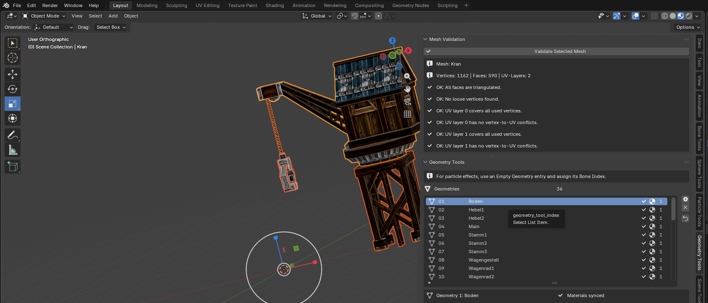
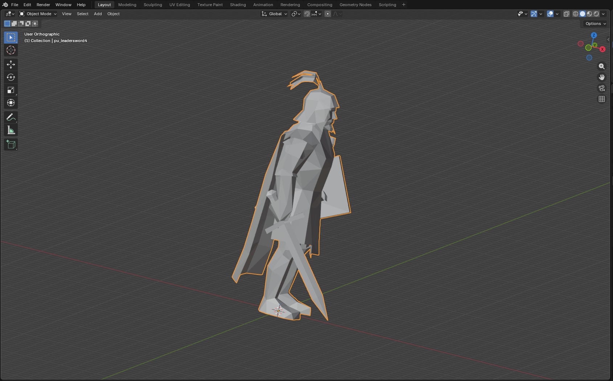
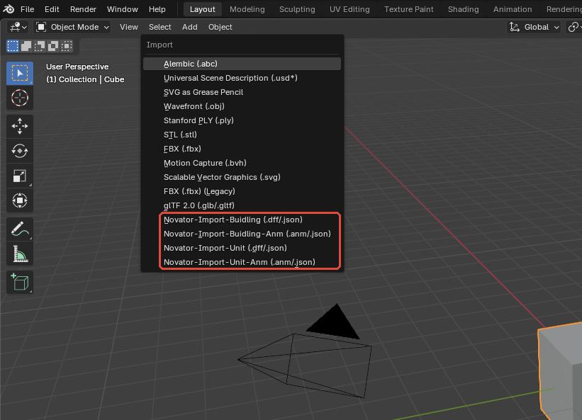

# The Settlers 5 – Novator12 DFF Tool für Blender

Blender-Add-on zum Importieren, Bearbeiten, Animieren und Exportieren von Gebäude- und Einheitenmodellen aus *The Settlers 5: Heritage of Kings* (*Die Siedler – Das Erbe der Könige*).

**Aktueller Stand:** Novator12 DFF Plugin Blender v5 **3.2.1** für **Blender 5.0.1** unter Windows.

Das Add-on verarbeitet RenderWare-Modelle (`.dff`) und Animationen (`.anm`) über ein lesbares JSON-Zwischenformat. Für die Umwandlung zwischen Binärformat und JSON wird die mitgelieferte `S5Converter.exe` aus dem Projekt von [mcb5637](https://github.com/mcb5637/S5Converter) verwendet.

> [!IMPORTANT]
> Gebäude-Import, -Export und -Animation wurden mit `PB_Factory` erfolgreich als Blender-/Konverter-Roundtrip geprüft. Der Unit-Import und der Unit-JSON-Export funktionieren mit `pu_leadersword4`; der binäre Unit-DFF-Export scheitert derzeit an einer bestätigten Schema-Inkompatibilität des Konverters. Details stehen unter [Bekannte Einschränkungen](#bekannte-einschränkungen).

## Funktionsumfang

### Gebäude

- Import und Export von Gebäudemodellen als `.dff` oder `.json`
- Import und Export von Gebäudeanimationen als `.anm` oder `.json`
- Aufbau und Erhalt von Frames, Armature, Bones, HAnim, Atomics und Geometry-Daten
- Verwaltung von Building- und Decal-Bone-UserData im **Bone Manager**
- Geometry-Einträge mit Mesh-, Bone- und Materialzuordnung
- Materialdaten für UV-Transformation, Dual-Texturierung, Ambient, Specular, Diffuse, Schnee- und Alpha-Texturen
- Partikeleffekt-Zuordnungen und leere Particle-Geometry-Einträge
- Erzeugung und Prüfung von Export-Bounding-Spheres
- Mesh-, UV- und BinMesh-Prüfwerkzeuge
- Erzeugung beziehungsweise Validierung der für den Export benötigten indexierten TriStrip-BinMesh-Daten
- Action-basierter Animationsworkflow mit FPS- und Root-Node-Behandlung



### Units

- Import von skinned Unit-Modellen als `.dff` oder `.json`
- Export des bearbeiteten Unit-Modells als diagnostisches `.json`
- Aufbau der Unit-Armature und Bone-Hierarchie
- Skinning über Vertex Groups, normalisierte Gewichte und Armature Modifier
- Import und Erhalt der Unit-Selection-Sphere
- Separate Unit-Animation-Befehle für `.anm` und `.json`
- Export der aktiven Action oder aller Actions einer ausgewählten Armature
- Unit-DFF-Ausgabe ist in der Oberfläche vorhanden, derzeit aber durch den bestätigten Konverterfehler blockiert



### Neue Blender-Werkzeuge

Das Add-on ergänzt die Sidebar des 3D Viewports um folgende Tabs:

| Tab | Aufgabe |
|---|---|
| **Bone Tools** | Building-UserData und Effektzuordnungen im **Bone Manager** verwalten |
| **Sphere Tools** | Building-Bounding-Spheres erzeugen und validieren |
| **Particle Tools** | Partikeleffekte hinzufügen, entfernen und zurücksetzen |
| **Geometry Tools** | Geometry- und Materialdaten verwalten sowie Mesh, UVs und BinMesh prüfen |
| **Scene Tools** | Szene vollständig leeren; siehe Sicherheitshinweis weiter unten |

Im Dope Sheet steht zusätzlich die Sidebar **Animation Tool** zur Verwaltung der Action-FPS zur Verfügung.

## Voraussetzungen

- Blender **5.0.1**
- Windows für den dokumentierten Binär-Konverter-Workflow
- vollständiger Add-on-Ordner `Novator12_DFF_Plugin_Blender_v5`
- die im Add-on enthaltene `S5Converter.exe`, wenn `.dff` oder `.anm` gelesen beziehungsweise geschrieben werden sollen
- Schreibzugriff auf einen separaten Arbeits- und Exportordner

Andere Blender-Versionen oder Betriebssysteme sind nicht Bestandteil des aktuellen Teststands.

## Installation

1. Verwende nach Möglichkeit das veröffentlichte Add-on-ZIP.
2. Wenn du das Repository direkt verwendest, packe nur den Ordner `BlenderPlugin/Novator12_DFF_Plugin_Blender_v5` als Add-on. Im ZIP muss `Novator12_DFF_Plugin_Blender_v5` der oberste Plugin-Ordner sein.
3. Achte darauf, dass Python-Module, der Unterordner `Comfort` und `S5Converter.exe` in ihrer ursprünglichen relativen Struktur bleiben.
4. Öffne in Blender **Edit > Preferences > Add-ons**.
5. Wähle im Add-ons-Menü **Install from Disk** und installiere das ZIP.
6. Suche nach `Novator12` oder `DFF` und aktiviere **Novator12 DFF Plugin Blender v5**.
7. Prüfe anschließend die neuen Einträge unter **File > Import** und **File > Export** sowie die Sidebar-Tabs im 3D Viewport (`N`).

> [!NOTE]
> Die aktuelle Oberfläche verwendet bei den Building-Menüeinträgen die Schreibweise `Buidling`. Das ist die tatsächliche Beschriftung des Add-ons und kein Fehler dieser README.

## Menüs

Unter **File > Import** werden vier Befehle registriert:

- `Novator-Import-Buidling (.dff/.json)`
- `Novator-Import-Buidling-Anm (.anm/.json)`
- `Novator-Import-Unit (.dff/.json)`
- `Novator-Import-Unit-Anm (.anm/.json)`

Unter **File > Export** stehen die passenden vier Gegenstücke zur Verfügung:

- `Novator-Export-Buidling (.dff/.json)`
- `Novator-Export-Buidling-Anm (.anm/.json)`
- `Novator-Export-Unit (.dff/.json)`
- `Novator-Export-Unit-Anm (.anm/.json)`



## Schnelleinstieg: Gebäude

1. Erstelle eine neue Blender-Datei und speichere sie, bevor du importierst.
2. Wähle **File > Import > Novator-Import-Buidling** und öffne eine `.dff`- oder `.json`-Datei.
3. Kontrolliere im Outliner die erzeugte Armature, die Meshes und die zugehörigen Hilfsobjekte.
4. Prüfe in **Geometry Tools** die Geometry-Zuordnung, Materialien, Triangulierung, UV-Daten und BinMesh-Metadaten.
5. Bearbeite Bone-, Sphere- und Particle-Daten nur in den dafür vorgesehenen Building-Panels.
6. Importiere eine zugehörige Animation erst auf das passende Gebäuderig und kontrolliere anschließend Action, Root und FPS.
7. Exportiere zuerst nach JSON. Prüfe die Datei und exportiere danach bei Bedarf nach DFF beziehungsweise ANM.
8. Importiere das erzeugte Binärformat in einer sauberen Blender-Datei erneut. Eine angelegte Datei allein ist noch kein erfolgreicher Roundtrip.

## Schnelleinstieg: Units

1. Arbeite in einer neuen, gespeicherten Blender-Datei.
2. Wähle **File > Import > Novator-Import-Unit** und öffne die Unit-DFF oder das passende JSON.
3. Prüfe Body-Mesh, `Armature_UnitSkin`, Armature Modifier, Vertex Groups, Gewichte und die markierte Selection Sphere.
4. Verändere die Rest-Hierarchie, Bone-Namen und Skin-Gruppen nur, wenn die Exportauswirkungen bekannt sind. Pro Vertex dürfen höchstens vier gültige Bone-Einflüsse exportiert werden.
5. Verwende zunächst **Novator-Export-Unit** mit dem Format **JSON** und kontrolliere das Ergebnis.
6. Verlasse dich mit Version 3.2.1 noch nicht auf den Unit-DFF-Export; der aktuelle Fehler ist unten dokumentiert.

Eine Unit-Animation benötigt eine passende Unit-Armature und Action. Die Menübefehle sind implementiert, wurden im aktuellen Audit wegen eines fehlenden passenden Unit-ANM-Beispiels jedoch nicht als Roundtrip bestätigt.

## Verifizierter Teststand

| Bereich | Ergebnis |
|---|---|
| `PB_Factory.blend` öffnen und prüfen | **PASS** |
| Building-JSON-Export | **PASS** |
| Building-DFF-Export und sauberer Re-Import | **PASS** |
| Building-Animation als JSON und ANM | **PASS** |
| Building-ANM-Re-Import | **PASS** |
| `pu_leadersword4.dff` als Unit importieren | **PASS** |
| Unit-JSON-Export | **PASS** |
| Unit-DFF-Export | **FAIL** – Konverter-Schemafehler bei `RpSkin.NumBones` |
| Unit-DFF-Re-Import | **NICHT AUSGEFÜHRT** – keine DFF erzeugt |
| Unit-ANM-Import/-Export/-Re-Import | **NICHT GETESTET** – kein passendes Sample vorhanden |
| Ingame-Prüfung | **NICHT GETESTET** |

Die PASS-Ergebnisse belegen den genannten Blender-/Add-on-/Konverterablauf mit den jeweiligen Testdateien. Sie sind keine Garantie für jedes Asset und kein Nachweis des Verhaltens im Spiel.

## Bekannte Einschränkungen

### Unit-DFF-Export

Der aktuelle Unit-JSON-Export funktioniert, aber der mitgelieferte Konverter lehnt die erzeugte Unit-Struktur beim binären DFF-Export ab:

```text
System.Text.Json.JsonException: The JSON property 'NumBones' could not be mapped to any .NET member contained in type 'S5Converter.Geometry.RpSkin'.
```

Das ist eine Schema-Inkompatibilität zwischen dem erzeugten JSON und der `RpSkin`-Abbildung des Konverters. Es handelt sich nicht um den Nachweis eines maximalen Bone-Limits. Bis zur Korrektur darf ein erfolgreicher Unit-DFF-Roundtrip nicht angenommen werden.

### Weitere Grenzen und Sicherheit

- Unit-Animationen sind implementiert, aber im aktuellen Audit nicht mit einem passenden Unit-ANM-Beispiel verifiziert.
- Der geprüfte Building-Animationsworkflow bestätigt Action- und Frame-Range-Roundtrips, aber keine Ingame-Bewegung oder vollständige Erhaltung von Scale-Kurven.
- Imports sind additiv und leeren die aktuelle Szene nicht automatisch.
- **Clear Scene** löscht szenenweit Objekte und Actions und bereinigt Daten ohne Bestätigungsdialog. Speichere vorher und verwende den Befehl nicht als gewöhnliches Löschen.
- Bounding- und Selection-Spheres sind exportrelevante Metadaten. Die Tests beweisen keine Kollisions- oder Selektionswirkung im Spiel.
- Arbeite immer auf Kopien und exportiere nie direkt über unveränderte Originaldateien.

## Dokumentation

| Dokument | Inhalt |
|---|---|
| [Englisches Handbuch (PDF)](docs/handbook/Settlers_5_Blender_Plugin_Handbook_EN.pdf) | Vollständige Einführung, Building- und Unit-Workflows, Abbildungen und Referenz |
| [Englisches Handbuch (Markdown)](docs/handbook/Settlers_5_Blender_Plugin_Handbook_EN.md) | Durchsuchbare Quellfassung des Handbuchs |
| [Testbericht](docs/handbook/Settlers_5_Blender_Plugin_Test_Report_EN.md) | Nachvollziehbare PASS-/FAIL-/NOT-TESTED-Ergebnisse |
| [Coverage-Matrix](docs/handbook/Settlers_5_Blender_Plugin_Coverage_Matrix_EN.md) | Zuordnung von Anforderungen, Kapiteln, Abbildungen und Testbelegen |

## Projektstruktur

```text
BlenderPlugin/
  Novator12_DFF_Plugin_Blender_v5/   # installierbares Add-on-Paket
docs/
  handbook/                          # Handbuch, Bilder und Testnachweise
README.md
CONTRIBUTING.md
CODE_OF_CONDUCT.md
SECURITY.md
```

## Herkunft, Beiträge und Community

Das JSON/DFF-/ANM-Verfahren baut auf dem [S5Converter von mcb5637](https://github.com/mcb5637/S5Converter) auf. Die Grundidee des Blender-Zwischenworkflows orientiert sich außerdem an Kimichuras älterem Siedler-5-Plugin `shokimpexp_rigid.py`, das in der Modding-Community geteilt wurde.

- Community: [Siedler MP Server auf Discord](https://discord.gg/b28BsKz)
- Fehler und Funktionswünsche: [GitHub Issues](https://github.com/Novator12/s5_BlenderPlugin/issues)
- Beiträge: [CONTRIBUTING.md](CONTRIBUTING.md)
- Sicherheitsmeldungen: [SECURITY.md](SECURITY.md)

Das Projekt befindet sich weiterhin in Entwicklung. Sichere Blender-Dateien, Quelldateien und Exporte regelmäßig in getrennten Backups.
