# The Settlers 5 - Novator12 DFF - Tool Handbook

**Baseline:** Blender 5.0.1 | Novator12 DFF Plugin Blender v5 3.2.1

**Publication:** English | 2026-08-11

This handbook explains how to understand, import, edit, validate, animate, and export *The Settlers 5* assets with Blender. It begins with the Blender and RenderWare concepts that make the later building and unit workflows understandable, predictable, and safe.

---

# Contents

<!-- PDF_TOC -->

---

# Part I - Foundations and Setup

# 1. About This Handbook

## 1.1 Purpose

The Novator12 DFF add-on connects two different worlds:

- Blender, where artists work with objects, meshes, armatures, materials, UV maps, and Actions; and
- the RenderWare-based model and animation data used by *The Settlers 5*.

The add-on can translate building models, unit models, and their animations between Blender and the formats used by the toolchain. That translation is not only a file conversion. A useful model must also preserve relationships: which mesh belongs to which frame, which vertices follow which bones, which material index belongs to each triangle, which sphere represents which bound, and which Action belongs to which armature.

This handbook therefore teaches the underlying ideas before presenting the operational workflows. A beginner should be able to understand not only which button to press, but also what the button changes and what must remain intact for export.

## 1.2 Intended audience

This handbook is for:

- modders who are new to Blender;
- Blender users who are new to RenderWare or DFF;
- artists who need a reliable building or unit workflow;
- technical users who need the exact add-on menus, fields, validation rules, and limitations; and
- developers who need a user-facing description of the add-on's current behavior.

No previous RenderWare knowledge is required. Readers who already know Blender should still review the sections about frames, rigid building assignments, unit skin weights, BinMesh data, and bounds because those concepts have workflow-specific meaning here.

## 1.3 How the handbook is organized

The handbook follows the order in which a new user should learn and work:

1. **Part I — Foundations and Setup** explains Blender data, DFF concepts, installation, and the add-on interface.
2. **Part II — Buildings** completes the entire building workflow: import, inspection, editing, effects, bounds, animation, validation, export, and round-trip verification.
3. **Part III — Units** then covers the corresponding skinned-unit workflow.
4. **Part IV — Reference** provides the complete control reference, troubleshooting guidance, limitations, glossary, and sources.

Building and unit procedures are intentionally kept separate. They may look similar in Blender, but they use different export structures. Building meshes are normally rigidly connected to frames, while a unit mesh is deformed by weighted bone influences.

## 1.4 Conventions used in this handbook

- **Choose** means select a menu command or button.
- **Enable** means turn on a checkbox or toggle.
- A path such as **File > Import** describes the sequence of Blender menus.
- `Monospaced text` identifies literal file extensions, names, properties, or values.
- UI labels are reproduced as they appear in add-on version 3.2.1. Several building commands contain the spelling `Buidling`; this is the spelling visible in the add-on, not a handbook typo.
- **Note** adds context or a useful explanation.
- **Warning** identifies a realistic risk of data loss, invalid output, or misleading results.

Screenshots are intended to show Blender 5.0.1 with the real add-on interface. A caption describes the exact information that should be visible so that a screenshot can be checked or replaced without changing the instructional purpose.

## 1.5 Safety principles

Keep these rules in mind throughout the handbook:

1. **Work on copies.** Preserve the original DFF, ANM, JSON, texture, and `.blend` files.
2. **Save before add-on repair or cleanup operations.** Some buttons do not explicitly register Blender Undo.
3. **Export JSON before binary output.** JSON is readable, easier to inspect, and separates Blender-side data generation from binary conversion.
4. **Re-import exported files in a clean Blender session.** File creation alone is not proof that a model or animation is correct.
5. **Test in an isolated game or mod environment.** Blender and converter checks cannot prove final in-game appearance or behavior.
6. **Do not use Clear Scene as an ordinary delete command.** The add-on's **Clear Scene** operation is file-wide, has no confirmation, deletes Actions and objects beyond the current selection, and purges data. Closing without saving and reopening a known-good file is the dependable recovery route.

> **Important:** Import operations are additive. Importing another asset does not automatically remove the current asset. For learning and testing, use one asset family per clean, saved `.blend` file.

## 1.6 Scope of the explanations

The fundamentals in Part I are focused on the concepts required for DFF and ANM work. They are not a replacement for every Blender modeling or animation topic. Links throughout the chapter lead to the official Blender 5.0 Manual for deeper study.

RenderWare documentation describes the general middleware structures. The add-on and converter determine how those structures are represented in this particular workflow. A structurally valid DFF can still be unsuitable for *The Settlers 5* because of hierarchy, naming, materials, texture references, root selection, animation, or engine-specific expectations.

---

# 2. Blender and DFF Fundamentals

## 2.1 Start with the scene, objects, and data

A Blender file can contain scenes, collections, objects, and reusable data-blocks. These words describe different levels of organization.

- A **Scene** contains the world, frame range, render settings, and links to collections.
- A **Collection** organizes objects. It is similar to a folder, although the same object can be linked in more than one collection.
- An **Object** has a name, location, rotation, scale, visibility state, parent, and optional modifiers.
- An object's **data-block** contains the specialized data it displays. A Mesh Object points to a Mesh data-block; an Armature Object points to Armature data.

This separation is fundamental. Moving a Mesh Object in Object Mode changes its object transform. Moving its vertices in Edit Mode changes its Mesh data. Two objects can even share one Mesh data-block, which means an Edit Mode change can affect both.

In a DFF workflow, the exporter may read raw mesh coordinates, object relationships, custom properties, armature data, and add-on metadata separately. A model can therefore look correct in the viewport while its export-facing data is incomplete or stale.

Use Blender's Outliner to confirm what is actually present. Do not rely only on what is visible in the 3D Viewport.

Official Blender references:

- [Data-blocks](https://docs.blender.org/manual/en/5.0/files/data_blocks.html)
- [Outliner introduction](https://docs.blender.org/manual/en/5.0/editors/outliner/introduction.html)
- [Collections](https://docs.blender.org/manual/en/5.0/scene_layout/collections/collections.html)
- [Blender Object API](https://docs.blender.org/api/5.0/bpy.types.Object.html)

## 2.2 Blender modes: what are you editing?

The current Blender mode changes what an action affects.

- **Object Mode** edits whole objects and their scene relationships. Use it for selection, transforms, parenting, modifiers, and most add-on operations.
- **Edit Mode** edits the internal structure of a mesh or an armature. For a mesh, this means vertices, edges, faces, and UV-connected topology. For an armature, it means the rest structure of bones.
- **Pose Mode** changes bone poses and is used for animation. It does not redefine the armature's rest structure.
- **Weight Paint Mode** edits the influence values that connect mesh vertices to armature bones.

Always check both the active object and the current mode before pressing an add-on button. A visible panel does not guarantee that the current context is valid. Some add-on validators switch a mesh from Edit Mode to Object Mode so that they can inspect the final mesh arrays.

Official Blender reference: [Interaction modes](https://docs.blender.org/manual/en/5.0/editors/3dview/modes.html).

## 2.3 Meshes: vertices, edges, faces, and loops

A **mesh** is a connected surface built from small geometric elements.

### Vertices

A **vertex** is a point in 3D space. It has an index and coordinates. The index is its position in the mesh's vertex array; many exported structures refer to vertices by these indices.

Moving a vertex changes the shape of every edge and face that uses it. Adding, deleting, merging, splitting, or reordering vertices can also change indices. That matters when imported metadata stores triangles or skin information separately from the current Blender polygons.

### Edges

An **edge** connects two vertices. Edges define the borders between faces and describe how the surface is connected. An edge can also exist without belonging to a face; such geometry is often called loose geometry.

An edge shared by two faces can be marked as a **seam** to tell Blender that the faces may separate into different UV islands. Edge connectivity is also used to detect non-manifold geometry, winding problems, and surface boundaries.

### Faces

A **face** is a surface bounded by edges. Blender also calls it a polygon.

- A triangle has three corners.
- A quad has four corners.
- An n-gon has more than four corners.

Blender can model all three. The DFF/BinMesh building workflow requires exported geometry to be represented as triangles. A quad that looks flat in Blender is not yet an explicit pair of export triangles, and different triangulation choices can produce different shading or triangle indices.

### Loops and face corners

A **loop** is Blender's record for one face corner. If two faces meet at one spatial vertex, each face still has its own loop at that corner. This allows the two faces to store different UV coordinates or corner normals while sharing the same vertex position.

This explains an important beginner question: “Why can one vertex appear more than once in the UV Editor?” It is because UV coordinates are associated with face corners. A vertex at a UV seam can legitimately have different UV positions on its neighboring faces.

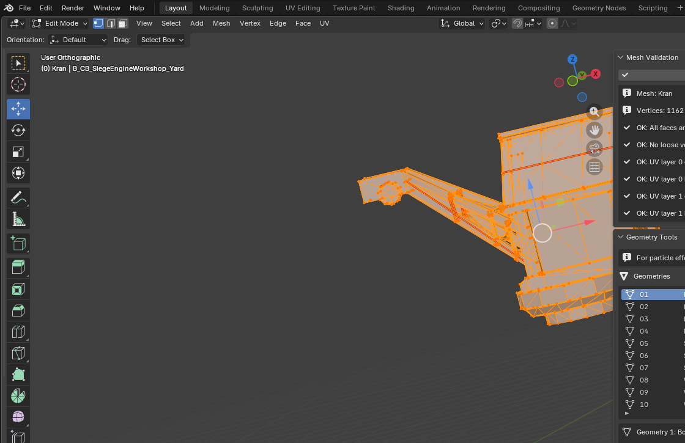

*Figure 1 — A close Blender 5.0.1 Edit Mode view displays mesh vertices, edges, and triangular faces together with the Edit Mode header and mesh-selection controls.*

Official Blender references:

- [Meshes: Introduction](https://docs.blender.org/manual/en/5.0/modeling/meshes/introduction.html)
- [Mesh structure](https://docs.blender.org/manual/en/5.0/modeling/meshes/structure.html)
- [Blender Mesh API](https://docs.blender.org/api/5.0/bpy.types.Mesh.html)

## 2.4 Topology, triangulation, normals, and winding

**Topology** describes how vertices, edges, and faces are connected. Two models can have the same silhouette but different topology. Export cares about the actual structure, not only the silhouette.

### Why triangles matter

A triangle is unambiguous: its three vertex indices completely define the face. RenderWare BinMesh data groups triangles by material. For a building, changing a polygon, its material index, or its vertex order can make the stored BinMesh data disagree with the Blender mesh.

Before a building export, every exported mesh face should be deliberately triangulated and inspected. Triangulation should be followed by mesh, UV, and BinMesh validation because it can change loops, indices, and shading.

### Normals

A **normal** is a direction perpendicular to a surface. Face normals describe which side of a polygon is considered the front. Vertex or corner normals influence smooth shading.

Incorrect normals can produce dark areas, inconsistent lighting, or invisible faces when back-face culling is used. A normal with zero length or a non-finite value is invalid.

### Winding

**Winding** is the order in which a face's vertices are traversed. Reversing that order normally reverses the face normal. Adjacent faces should use consistent winding unless a deliberate special case requires otherwise.

Blender's Face Orientation overlay is useful for detecting reversed faces. Recalculate normals only after understanding which surfaces should face outward, especially on intentionally mirrored or double-sided parts.

### Common topology problems

- **Loose vertex:** a vertex used by no face.
- **Degenerate face:** a face with repeated indices, zero area, or otherwise invalid geometry.
- **Non-manifold edge:** an edge whose face relationships do not describe a normal closed or open surface, for example an edge used by more than two faces.
- **Duplicate geometry:** vertices or faces occupying the same location without an intended relationship.
- **Non-triangular face:** a quad or n-gon remaining in a triangle-only export path.

Official Blender references:

- [Editing normals](https://docs.blender.org/manual/en/5.0/modeling/meshes/editing/mesh/normals.html)
- [Mesh cleanup](https://docs.blender.org/manual/en/5.0/modeling/meshes/editing/mesh/cleanup.html)
- [3D Viewport overlays](https://docs.blender.org/manual/en/5.0/editors/3dview/display/overlays.html)

## 2.5 Materials, textures, and UV coordinates

### Materials and material slots

A Blender **material** describes how a surface should be rendered. A Mesh Object has an ordered list of material slots, and each face stores a material-slot index.

Slot order is therefore data, not merely presentation. If slot 0 and slot 1 are exchanged, faces can receive the wrong exported material even when both material names still exist. Building BinMesh groups also mirror the relationship between triangles and material indices.

The add-on stores additional export-facing material metadata for buildings. Examples include material names, lighting flags, UV-transform or dual-texture behavior, snow texture data, and texture alpha. These values do not necessarily produce a complete Blender viewport preview of the game effect.

### Textures

A **texture** is an image or generated pattern used by a material. In the game pipeline, file names, base names, alpha handling, and additional texture references can matter independently of how a Blender shader node tree looks.

Do not assume that a pink-free viewport proves the exported texture reference is correct. Inspect material slots, image paths, add-on material metadata, and exported JSON.

### UV coordinates

A **UV map** places the corners of 3D faces onto a 2D texture. `U` and `V` are the two axes of that texture plane.

Imagine cutting a cardboard model so that it can lie flat. The cuts are UV seams, and the flattened pieces are UV islands. A vertex at a cut can have one 3D position but different UV coordinates on the faces on either side.

For this exporter, UV data must be structurally consistent with the mesh loops. Problems include:

- no UV layer;
- more UV layers than the exporter supports;
- a mismatch between UV entries and mesh loops;
- non-finite UV values;
- different UV values that require a split or seam but have neither; and
- topology changes made after UV or triangle metadata was prepared.

Automatic UV repair can split vertices, mark seams, remove loose vertices, and recalculate normals. These are real topology changes. Save first, then rebuild dependent building data such as BinMesh and bounding spheres.

Official Blender references:

- [UV unwrapping introduction](https://docs.blender.org/manual/en/5.0/modeling/meshes/uv/unwrapping/introduction.html)
- [UV layout workflow](https://docs.blender.org/manual/en/5.0/modeling/meshes/uv/workflows/layout.html)
- [Materials introduction](https://docs.blender.org/manual/en/5.0/render/materials/introduction.html)
- [Material assignment](https://docs.blender.org/manual/en/5.0/render/materials/assignment.html)
- [Image Texture node](https://docs.blender.org/manual/en/5.0/render/shader_nodes/textures/image.html)

## 2.6 Armatures, bones, frames, and hierarchies

### Armatures and bones in Blender

An **armature** is Blender's skeleton data type. It contains **bones** arranged in a hierarchy.

A bone has a head, a tail, an orientation, and optional parent/child relationships. Connected bones can form a chain. The armature has a rest structure, while Pose Mode applies pose transforms on top of that structure.

- Edit Mode changes the rest structure. This is a high-risk operation for an imported asset because meshes, bind transforms, animations, and identifiers must continue to agree.
- Pose Mode changes the current pose and is the appropriate mode for testing deformation or creating animation keys.

### Frames in RenderWare

RenderWare uses a hierarchy of **frames**. A frame is a transform node. It can position geometry, act as a skeleton node, or provide a parent for another frame.

The add-on represents the imported frame hierarchy with a Blender armature and bones. However, a friendly Blender bone name, an internal frame index, and an HAnim node ID are not automatically the same value. The building Bone Manager exists because format-specific mappings may be required in addition to the visible hierarchy.

Typical imported armature object names are:

- `Armature_Skin` for a building workflow; and
- `Armature_UnitSkin` for a skinned-unit workflow.

These names are useful identifiers, but the hierarchy, custom data, vertex groups, and selected exporter must also agree.

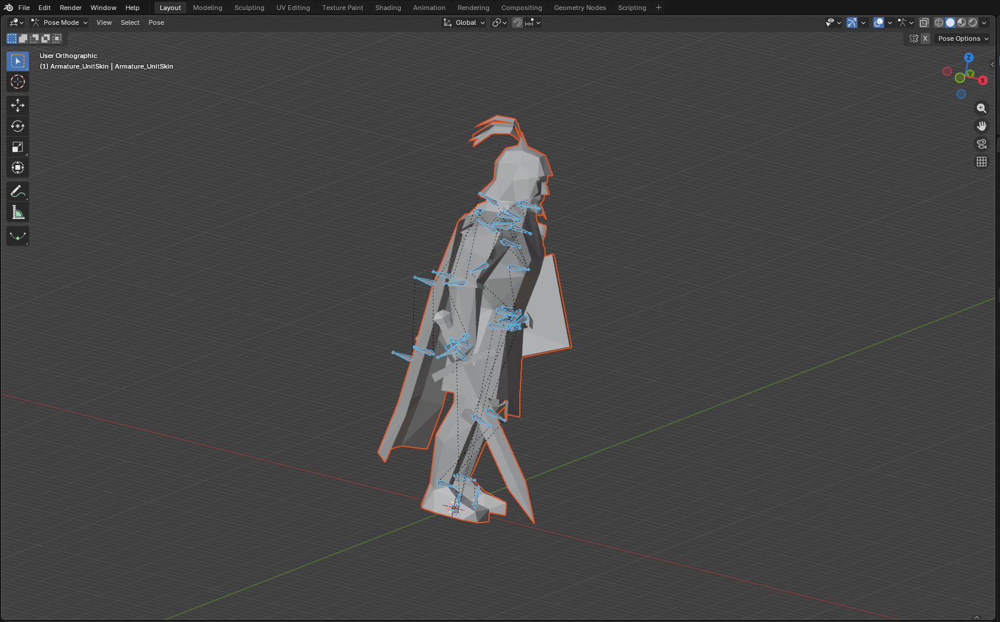

*Figure 2 — An imported unit armature is selected in Blender 5.0.1 Pose Mode, with its connected bone hierarchy visible through the body mesh.*

Official Blender references:

- [Armatures introduction](https://docs.blender.org/manual/en/5.0/animation/armatures/introduction.html)
- [Armature structure](https://docs.blender.org/manual/en/5.0/animation/armatures/structure.html)
- [Bone structure](https://docs.blender.org/manual/en/5.0/animation/armatures/bones/structure.html)
- [Posing introduction](https://docs.blender.org/manual/en/5.0/animation/armatures/posing/introduction.html)

## 2.7 Vertex groups, weights, and the connection to bones

A **vertex group** is a named set of mesh vertices. Each included vertex can have a weight from 0 to 1.

- A weight of 0 means no influence.
- A weight near 1 means strong influence.
- Several groups can contain the same vertex.

An Armature modifier looks for vertex-group names that correspond to bone names. When the bone moves, the modifier uses the group's weights to calculate how strongly each vertex follows it.

### Rigid building connection

A normal building mesh part is treated as rigid. Instead of bending smoothly between several bones, the part is associated with one controlling frame/bone. In the current building export path, the first usable vertex group and matching armature relationship are important.

Conceptually, every vertex in a rigid part follows the same controlling transform. A door, wheel, flag mount, or other separately animated building part can therefore move as one piece.

### Skinned unit connection

A unit is conceptually different. Its body mesh bends across joints. A shoulder vertex might be influenced mostly by an upper-arm bone and partly by a torso bone. These per-vertex influences become RenderWare SkinPLG data.

The unit export path retains at most the four strongest positive influences that map to valid bones and normalizes them. This conceptual rule explains why unweighted vertices, unknown group names, or too many important influences can produce incorrect deformation.

The later Unit part of the handbook gives the operational procedure. At this stage, remember the core difference:

| Connection | Building | Unit |
|---|---|---|
| Intended deformation | Rigid mesh part | Smoothly skinned mesh |
| Primary Blender link | One usable bone-named vertex group plus Armature modifier | Bone-named vertex groups with per-vertex weights plus Armature modifier |
| Export concept | Mesh part follows one frame | Each vertex can follow several bones |
| Main editing risk | Wrong first group or wrong controlling bone | Missing, unknown, excessive, or unnormalized influences |

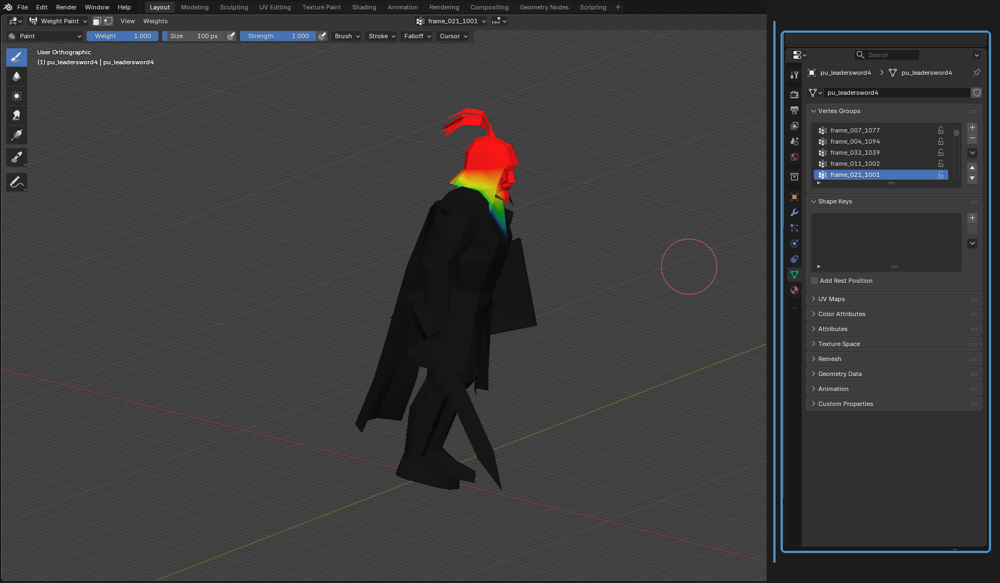

*Figure 3 — Blender 5.0.1 Weight Paint Mode displays an imported skinned mesh and its active bone-aligned vertex group; the blue-to-red color range visualizes low-to-high influence.*

Official Blender references:

- [Skinning introduction](https://docs.blender.org/manual/en/5.0/animation/armatures/skinning/introduction.html)
- [Parenting to an armature](https://docs.blender.org/manual/en/5.0/animation/armatures/skinning/parenting.html)
- [Armature modifier](https://docs.blender.org/manual/en/5.0/modeling/modifiers/deform/armature.html)
- [Vertex groups](https://docs.blender.org/manual/en/5.0/modeling/meshes/properties/vertex_groups/introduction.html)
- [Vertex weights](https://docs.blender.org/manual/en/5.0/modeling/meshes/properties/vertex_groups/vertex_weights.html)
- [Weight Paint introduction](https://docs.blender.org/manual/en/5.0/sculpt_paint/weight_paint/introduction.html)

## 2.8 Transforms, origins, parenting, and export space

An object's **transform** consists of location, rotation, and scale. Its **origin** is the reference point around which object transforms operate. A parent creates a transform relationship: the child inherits the parent's motion.

Blender distinguishes object transforms from the coordinates stored in a Mesh data-block. For example, scaling an object to 2 does not necessarily double every stored vertex coordinate. Applying the scale changes that relationship by baking the transform into the data.

This matters because an exporter can read raw mesh coordinates and explicit hierarchy transforms rather than an arbitrary evaluated modifier stack. A viewport result produced by unapplied transforms or modifiers is not automatically the same as the exported result.

Use these principles:

- Keep imported transforms unchanged until the hierarchy is understood.
- Do not apply the transform to only the mesh or only the armature without checking their relationship.
- Treat mirror, subdivision, geometry-node, and other modifiers as viewport or authoring operations until a round-trip test proves how they are exported.
- When a topology-producing modifier is intentional, bake it on a backup and repeat every dependent validation step.
- Check the parent, Armature modifier target, and object origin after a transform change.

**Export space** means the coordinate system in which the add-on writes the final values. A building sphere, frame transform, and mesh vertex may originate in different Blender spaces before the exporter converts them. This is why manually moving a visible proxy is not always equivalent to changing the stored export value.

Official Blender references:

- [Object transforms](https://docs.blender.org/manual/en/5.0/scene_layout/object/properties/transforms.html)
- [Apply transforms](https://docs.blender.org/manual/en/5.0/scene_layout/object/editing/apply.html)
- [Parenting objects](https://docs.blender.org/manual/en/5.0/scene_layout/object/editing/parent.html)

## 2.9 Bounds: bounding boxes, bounding spheres, and selection spheres

A detailed mesh can contain thousands of triangles. Testing every triangle merely to decide whether an object is potentially visible would be expensive. Engines therefore use simpler **bounds** for coarse tests.

### Axis-aligned bounding box

An **axis-aligned bounding box**, or AABB, is the smallest box aligned to the coordinate axes that encloses the considered points. Its center can be calculated halfway between the minimum and maximum coordinates on X, Y, and Z.

### Bounding sphere

A **bounding sphere** is a center point plus a radius. A simple way to construct one is:

1. calculate an AABB center;
2. measure the distance from that center to every mesh vertex; and
3. use the greatest distance as the radius.

This creates a sphere that encloses the current vertices. The building Sphere Tools follow this general calculation and store export-facing center/radius data on a hidden wireframe proxy.

A bounding sphere is commonly useful for culling or other coarse spatial tests. That does **not** prove that it is the precise gameplay collision shape. Call it a bound unless game-specific evidence demonstrates collision behavior.

### Unit selection sphere

An imported unit can have a separately marked **SelectionSphere**. It is not interchangeable with a building sphere generated by Sphere Tools. The two objects serve different data paths, use different identifying properties, and are read differently by export.

### When bounds become stale

Changing mesh vertices can invalidate a previously calculated bound. Changing object transforms can also alter the relationship between visible and export-space data. After a building mesh edit, regenerate or validate its sphere. The dedicated Unit workflow later explains how the imported selection-sphere marker and relationship constrain supported edits.

Official Blender references:

- [Viewport bounds display](https://docs.blender.org/manual/en/5.0/scene_layout/object/properties/display.html)
- [Bounding Box Center pivot](https://docs.blender.org/manual/en/5.0/editors/3dview/controls/pivot_point/bounding_box_center.html)

> **Terminology caution:** Blender's Bounding Box Center pivot chooses a transform pivot. It is not the same thing as the RenderWare bounding sphere exported by the add-on.

## 2.10 How DFF model data is structured

A DFF file is a structured RenderWare container, not merely a Blender mesh saved under another extension.

The important concepts are:

- **Clump:** a model-level grouping of frames and renderable objects.
- **Frame:** a node in a transform hierarchy.
- **Geometry:** positions, triangles, normals, UV data, material references, bounds, and related arrays.
- **Atomic:** a renderable association between one Geometry and one Frame.
- **Material:** surface and texture-related information referenced by geometry.
- **BinMesh:** extension data that groups triangles by material for rendering.
- **HAnim:** hierarchy and numerical node information used by skeletal/animation relationships.
- **SkinPLG:** per-vertex bone indices, weights, and skin-related data for a skinned mesh.
- **UserData and other extensions:** additional metadata such as game-specific building effects or tags.

The Blender representation distributes this information across different places:

| DFF/RenderWare concept | Typical Blender/add-on representation |
|---|---|
| Frame hierarchy | Armature and bones |
| Geometry | Mesh data-block |
| Atomic-to-frame relationship | Mesh, vertex group, armature, and Geometry metadata relationship |
| Materials | Blender material slots plus add-on metadata |
| BinMesh | Stored/generated Geometry Tools data |
| SkinPLG | Unit vertex groups, weights, bone mapping, and imported custom data |
| Bounding sphere | Export properties and a proxy or marked sphere object |
| UserData effect | Bone Manager mapping or other add-on metadata |

This distributed representation is why deleting a panel row may not delete a Blender object, and deleting a Blender object may leave metadata that refers to something missing.

Original RenderWare references:

- [RenderWare 3 documentation repository](https://github.com/electronicarts/RenderWare3Docs)
- [RenderWare Graphics User Guide, Volume I](https://github.com/electronicarts/RenderWare3Docs/blob/master/userguide/UserGuideVol1.pdf)
- [RenderWare Graphics User Guide, Volume II](https://github.com/electronicarts/RenderWare3Docs/blob/master/userguide/UserGuideVol2.pdf)
- [RenderWare Graphics User Guide, Volume III](https://github.com/electronicarts/RenderWare3Docs/blob/master/userguide/UserGuideVol3.pdf)

## 2.11 Animation basics: keyframes, Actions, ANM, and FPS

A **keyframe** stores a property value at a time. Blender represents time in frames.

An **Action** groups animation channels, such as a bone's location and quaternion rotation curves. The Dope Sheet's Action Editor shows these channels and keys. The NLA Editor can reference Actions in strips.

An imported model supplies the armature. An imported animation supplies motion for that armature and becomes a Blender Action. Model and animation files are therefore separate; load the matching model before its animation.

**FPS**, or frames per second, controls how quickly frame numbers are played. An Action spanning frames 0–30 lasts one second at 30 FPS but two seconds at 15 FPS. Changing only Blender's playback FPS is not the same as rescaling the keyframe times.

The animation format labels visible in the add-on include hierarchical, compressed, and nodes-oriented terms. These names describe format structures, but a visible selector is not by itself proof that every exporter writes every listed encoding. The workflow chapters identify what the current importers and exporters actually handle.

Official Blender references:

- [Keyframes](https://docs.blender.org/manual/en/5.0/animation/keyframes/introduction.html)
- [Action Editor](https://docs.blender.org/manual/en/5.0/editors/dope_sheet/modes/action.html)
- [Timeline](https://docs.blender.org/manual/en/5.0/editors/timeline.html)

## 2.12 DFF, ANM, JSON, and S5Converter

The add-on exposes three file representations:

- `.dff` — binary model data;
- `.anm` — binary animation data; and
- `.json` — readable interchange data used by the add-on and converter workflow.

Binary conversion follows this conceptual route:

```text
DFF or ANM  <->  S5Converter.exe  <->  JSON  <->  Blender add-on data
```

The Python add-on reads and writes JSON directly. For binary DFF or ANM, it calls the bundled `S5Converter.exe`. This creates a useful diagnostic boundary.

- If Blender-to-JSON fails, inspect the scene, add-on metadata, active context, and Python error.
- If JSON succeeds but binary conversion fails, preserve the JSON and inspect converter output and schema compatibility.
- If binary export succeeds, re-import the generated binary in a clean session. Do not stop at the success message.

JSON is not a DFF or ANM merely because it contains the same information. Renaming a `.json` file to `.dff` does not perform conversion.

S5Converter is a community tool, not official Ubisoft software. In the tested add-on package it is bundled beside the add-on code; there is no add-on Preferences field for choosing an arbitrary converter path.

Community converter reference: [S5Converter repository](https://github.com/mcb5637/S5Converter).

---

# 3. Installation and Interface Tour

## 3.1 Requirements

Prepare:

- Blender 5.0.1;
- the complete `Novator12_DFF_Plugin_Blender_v5` add-on distribution;
- the bundled `S5Converter.exe` in the package when binary DFF/ANM conversion is required;
- read access to the model, animation, and texture files you are authorized to use; and
- a writable project folder for `.blend`, JSON, DFF, ANM, and test output.

The documented binary converter is a Windows executable. JSON handling is performed by the add-on, but the documented binary runtime path was established on Windows. Other operating systems or Blender versions require independent verification.

## 3.2 Prepare the add-on archive

Use the release ZIP supplied with the project when available. Do not install the complete Git repository as though it were the add-on archive.

For a development package, preserve one top-level `Novator12_DFF_Plugin_Blender_v5` folder. Its `__init__.py`, Python modules, support folders, and converter must remain in their intended relative locations. Do not flatten the package or copy only the visible entry file.

## 3.3 Install in Blender 5.0.1

1. Start Blender 5.0.1.
2. Choose **Edit > Preferences**.
3. Open **Add-ons**.
4. Open the Add-ons menu in the upper-right area and choose **Install from Disk**.
5. Select the add-on ZIP and confirm.
6. Search for `Novator12` or `DFF`.
7. Enable **Novator12 DFF Plugin Blender v5** if it is not enabled automatically.
8. Close Preferences.

Official Blender reference: [Installing and managing add-ons](https://docs.blender.org/manual/en/5.0/editors/preferences/addons.html).

If Blender reports an error while enabling the add-on, inspect the system console. Typical setup causes include an incomplete ZIP, the wrong folder nesting, or missing package modules. Reinstall from a clean, complete archive rather than moving individual modules until the error disappears.

## 3.4 Verify the File menu commands

Choose **File > Import**. The add-on should contribute four separate commands:

- **Novator-Import-Buidling (.dff/.json)**
- **Novator-Import-Buidling-Anm (.anm/.json)**
- **Novator-Import-Unit (.dff/.json)**
- **Novator-Import-Unit-Anm (.anm/.json)**


*Figure 4 — The open Blender 5.0.1 **File > Import** menu displays all four Novator model and animation commands for Buildings and Units. The editorial red outline identifies the add-on block; the visible `Buidling` spelling reproduces the current UI.*

Choose **File > Export**. The corresponding commands should be present:

- **Novator-Export-Buidling (.dff/.json)**
- **Novator-Export-Buidling-Anm (.anm/.json)**
- **Novator-Export-Unit (.dff/.json)**
- **Novator-Export-Unit-Anm (.anm/.json)**

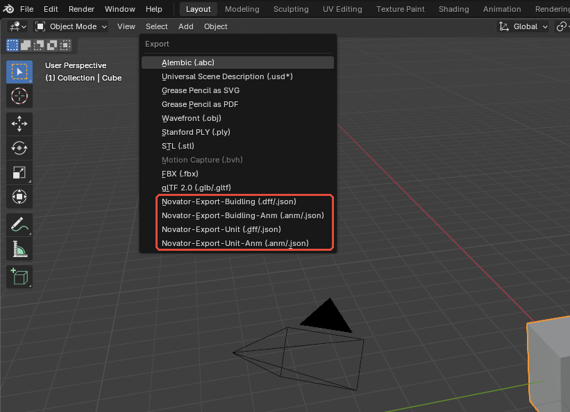

*Figure 5 — The open Blender 5.0.1 **File > Export** menu displays all four Novator model and animation commands for Buildings and Units. The editorial red outline identifies the add-on block.*

The commands are deliberately separate. A building model, building animation, unit model, and unit animation must be sent through the matching menu path. The later Building and Unit parts explain those operations in their complete workflow order.

## 3.5 Verify the 3D Viewport sidebar

Move the pointer over the 3D Viewport and press `N`. The add-on registers these vertical tabs:

- **Bone Tools** — contains the **Bone Manager** panel for building UserData/effect mappings;
- **Sphere Tools** — building export-sphere generation and validation;
- **Particle Tools** — building particle-effect bindings;
- **Geometry Tools** — building Geometry records, material metadata, mesh/UV validation, and BinMesh tools; and
- **Scene Tools** — contains the destructive **Clear Scene** operation.

Most of these tools are building-oriented. Their presence while a unit or unsuitable object is active does not mean that they apply to that data. Most panels do not hide themselves when the context is invalid; a button may remain visible and fail only when invoked.

The add-on also registers **Animation Tool** in the Dope Sheet sidebar. Open a Dope Sheet editor and press `N` to locate it. Model and animation operations remain available in the File menu even when this panel is closed.

## 3.6 Understand the interface before pressing buttons

Blender context is determined by several things at once:

- active editor;
- active object;
- selected objects;
- current mode;
- active armature and Action;
- selected add-on list row; and
- file browser format options.

Before any add-on operation, answer these questions:

1. Am I using the Building or Unit command that matches the asset?
2. Am I working with a model or an animation?
3. Is the intended mesh or armature active?
4. Am I in the mode required by the operation?
5. Is the `.blend` saved, and do I have a separate backup?
6. Am I writing to a new output path rather than an original game file?

The complete control reference later in the handbook records each button's prerequisites, defaults, side effects, Undo declaration, and confirmation behavior.

## 3.7 Create a safe project folder

Use a separate workspace for each asset family:

```text
MyS5Asset/
  source/        # untouched original DFF, ANM, and textures
  blend/         # editable Blender files and dated backups
  json/          # readable diagnostic/interchange output
  export/        # generated DFF and ANM files
  test/          # copies deployed to an isolated test environment
```

Recommended file habits:

- Keep original source files read-only when practical.
- Save an initial import before editing.
- Save an incremented backup before topology, UV, armature, weighting, timing, sphere, BinMesh, or cleanup changes.
- Export to an empty or asset-specific directory so partial multi-file output is obvious.
- Preserve Blender console output when reporting a failure.

## 3.8 Recommended initial Blender setup

Before the first workflow:

1. Save the Blender file.
2. Keep one model and its related animations in the working file.
3. Use the Outliner to verify object and armature names.
4. Keep imported object transforms unchanged until the relevant Building or Unit workflow explains their role.
5. Leave the scene at the imported or intended animation frame rate; do not assume 30 FPS. The verified `PB_Factory` example uses 24 FPS.
6. Enable overlays such as Face Orientation, seams, normals, or object names only when they answer a specific inspection question.
7. Avoid **Clear Scene** in a valuable or multi-scene file.

## 3.9 Updating or reinstalling the add-on

When replacing the add-on with another build:

1. Save and close Blender sessions that use the add-on.
2. Preserve the old package so an existing project can be reproduced.
3. Disable or remove the old add-on through Preferences.
4. Install the complete replacement package.
5. Restart Blender.
6. Repeat the File menu and sidebar checks.
7. Perform model and animation smoke tests on disposable copies before opening production work.

UI registration proves only that Blender loaded the add-on. It does not prove converter compatibility or asset correctness. The Building workflow begins with a controlled import and ends with a clean-session round trip; the Unit workflow follows only after the complete Building part.

---

*End of Part I. Part II begins the complete Building workflow before any operational Unit procedure.*

# Part II - Buildings

This part describes the rigid-building workflow of Novator12 DFF Plugin Blender v5 3.2.1 in Blender 5.0.1. It uses `PB_Factory.blend` as the principal worked example. The example was inspected and round-trip tested with the actual add-on and bundled converter.

The results in this part establish Blender/add-on/converter behavior for this specific scene. They do not prove identical binary output, visual equivalence in *The Settlers 5*, gameplay behavior, collision behavior, or compatibility with every building asset.

# 4. Building Workflow Overview and PB_Factory Example

## 4.1 The building data path

A building is more than its visible meshes. The add-on coordinates several layers of data:

1. `Armature_Skin` supplies the RenderWare frame hierarchy.
2. Each rigid mesh normally uses its first vertex group and an Armature modifier to identify its controlling frame.
3. Geometry Tools records determine export order, linked objects, material metadata, and stored BinMesh data.
4. Bone Manager records add building/decal UserData effects to selected frame and HAnim node identifiers.
5. Particle Tools records associate particle payloads with particle-only Geometry frames.
6. Hidden sphere helpers preserve per-Geometry export bounds.
7. A Blender Action supplies building animation transforms.
8. JSON is the inspectable representation; DFF and ANM pass through the bundled `S5Converter.exe`.

The recommended order is therefore:

`open/import → inspect hierarchy → edit mesh/materials → validate mesh/UV/BinMesh → rebuild bounds → inspect effects/particles → inspect animation → export JSON → export binary → clean re-import → in-game test`

## 4.2 Verified PB_Factory inventory

The test scene `docs/handbook/_test/PB_Factory.blend` contains one complete configured building example.

| Area | Verified PB_Factory state |
|---|---:|
| Blender objects | 73 |
| Armature objects | 1 (`Armature_Skin`) |
| Mesh objects | 72 |
| Geometry-record meshes | 36 |
| Sphere/helper meshes | 36 |
| Geometry vertices | 9,200 |
| Geometry edges | 13,067 |
| Geometry faces | 5,660 |
| Triangulation | All 36 Geometry meshes triangulated |
| Armature bones | 82; root `frame_000` |
| Assigned materials | 8 |
| Geometry Tools records | 36 |
| Bone Manager records | 3 |
| Particle Tools records | 2 |
| Actions | 1 (`Armature_SkinAction`) |

The 36 helper meshes correspond to Geometry bounds and particle helpers. Thirty-five are hidden in the saved viewport state. `Zaun` is the only Geometry mesh hidden in the saved state. Sphere/helper topology is not building render topology and must not be included in the 9,200-vertex or 5,660-face Geometry totals.

The eight assigned materials are `B_CB_Military`, `B_CB_SiegeEngineWorkshop_Yard`, `PB_Archery2`, `PB_Blacksmith2`, `PB_Sawmill2`, `PB_Tower2`, `XB_Decals1`, and `XD_Misc2`.


*Figure 6 — The PB_Factory overview shows a selected building mesh beside the add-on's Mesh Validation and Geometry Tools panels.*

## 4.3 Workflow: open and orient yourself in PB_Factory

**Goal:** Open the verified building scene and identify the objects, armature, tool records, and Action without changing the source file.

**Prerequisites:** Blender 5.0.1; add-on 3.2.1 registered; the complete `PB_Factory.blend` file; a writable location for a separate working copy.

**Starting state:** Blender is open with no valuable unsaved work. The source PB_Factory file is retained unchanged.

**Menu path:** `File > Open` → `docs/handbook/_test/PB_Factory.blend`

1. Open the file and immediately use **File > Save As** to create a working copy outside the test-fixture path.
2. In the Outliner, locate `Armature_Skin`, the named building meshes, and the `_Sphere` helpers.
3. Keep the helpers hidden and frame the visible building with **Home** or **View > Frame All**.
4. Select `Main`. The saved file can report `Main` as active while no object is selected, so click it explicitly before using a context-sensitive operator.
5. Press `N` in the 3D Viewport and review the five add-on tabs.
6. In Geometry Tools, select row **04**, which links to `Main`. The saved Geometry selection is row 01 (`Boden`), so align the row with the active object before validation.
7. Review Bone Manager's three rows and Particle Tools' two rows without pressing Reset or Remove.
8. Select `Armature_Skin`, open an Action Editor, and locate `Armature_SkinAction`.

**Expected result:** The working copy shows one 82-bone armature, 36 configured Geometry records, three effect mappings, two particle mappings, and one Action. No source asset is changed.

**Verification:** Compare the scene with the inventory table above. Confirm that the 36 Geometry names include `Main`, `Boden`, `Kran`, `PE_Smoke`, and `PE_Fire`, and that the helper objects are not mistaken for render meshes.

**Recovery:** If anything was changed accidentally, close the working copy without saving and reopen the untouched source. Do not use **Clear Scene** as a recovery operation; it is destructive and file-wide.

## 4.4 Representative PB_Factory components

The following components make useful teaching examples:

- `Main`: 1,520 vertices, 2,148 edges, 928 triangles; rigid group `frame_001_603`; material `PB_Sawmill2`; UV layers `Float2` and `UVMap_Snow`; DualTex enabled; snow texture `PB_snow1`; stored BinMesh data.
- `Boden`: 416 vertices, 524 edges, 199 triangles; rigid group `frame_002_604`; material `XB_Decals1`; DualTex enabled; snow texture `XB_Decals1_snow`; matches the Decal mapping `Idx 2 / Num 604`.
- `Kran`: 1,162 vertices, 1,466 edges, 590 triangles; rigid group `frame_062_615`; material `B_CB_SiegeEngineWorkshop_Yard`; DualTex enabled; snow texture `PB_snow1`; matches the Building + Tag mapping `Idx 62 / Num 615`.
- `PE_Smoke`: zero vertices/faces, `Empty-Geometry` BinMesh state, rigid group `frame_051_602`; paired with particle index 51 and type `smoke10`.
- `PE_Fire`: zero vertices/faces, `Empty-Geometry` BinMesh state, rigid group `frame_080_701`; paired with particle index 80 and type `fire01`.

# 5. Importing Building Models

## 5.1 Building importer behavior

The exact current menu label contains the spelling `Buidling`. This is an add-on UI string, not a handbook typo.

- DFF input uses the bundled converter and then loads the generated JSON representation.
- JSON input bypasses binary conversion and is useful for diagnosis.
- Import is additive. Existing objects and existing tool rows are not cleared.
- The normal result includes `Armature_Skin`, rigid meshes, Geometry/Bone/Particle metadata, and hidden wire sphere helpers.
- Keep `.dff` lowercase. The current operator accepts uppercase `.DFF`, but a later case-sensitive suffix check can misroute it as JSON.

PB_Factory is a prepared `.blend` example, not evidence that a newly imported arbitrary DFF will contain the same number of meshes or metadata records.

## 5.2 Workflow: import a building DFF or JSON model

**Goal:** Load one rigid building model into an isolated Blender scene while preserving all add-on metadata.

**Prerequisites:** Blender 5.0.1; add-on 3.2.1; `S5Converter.exe` beside the add-on for DFF input; one building `.dff` or converter-compatible `.json`; a backup of the original game asset.

**Starting state:** A new, expendable `.blend` file with no other imported game model. Save it before import.

**Menu path:** `File > Import > Novator-Import-Buidling (.dff/.json)`

1. Choose a lowercase `.dff` for binary input or `.json` for direct structural input.
2. Confirm the exact source path in Blender's file browser and press the import button.
3. Wait for the file browser to close; for DFF, review the System Console for converter errors.
4. In the Outliner, identify `Armature_Skin`, the rigid mesh objects, and sphere helpers.
5. Select the armature and confirm that bones were created beneath `frame_000` or the imported root.
6. Open Geometry Tools and confirm that normal meshes have linked records and material entries.
7. Open Bone Tools and Particle Tools and record any imported rows before editing them.
8. Inspect one render mesh. Confirm that its first vertex group names a valid armature bone and that its Armature modifier targets `Armature_Skin`.
9. Save the imported result as a new working file; never overwrite the source DFF or JSON.

**Expected result:** Blender contains one coherent building hierarchy with linked rigid meshes and the metadata needed for validation and export. The import does not remove any pre-existing objects.

**Verification:** Record object, mesh, material, armature, bone, Geometry, sphere, Bone Manager, and Particle Tool counts. Check that render meshes are visible while sphere helpers are hidden and non-rendering. For DFF, absence of a console exception is necessary but not sufficient; later perform a JSON/DFF export and clean re-import.

**Recovery:** If the wrong model was imported, close without saving and reopen the clean starting file. Avoid importing a second copy into the same scene because duplicate objects and accumulated Geometry/Particle rows make diagnosis ambiguous.

## 5.3 Imported building structure to preserve

Preserve these relationships unless a deliberate rebuild is planned:

- `Armature_Skin` name and hierarchy.
- Bone names such as `frame_001_603`, in which the values encode frame and HAnim identity.
- The first vertex group on every rigid mesh.
- The Armature modifier target.
- Material-slot order and polygon material indices.
- Geometry Tools record order and object links.
- BinMesh JSON for unchanged topology.
- Hidden sphere linkage and export center/radius properties.
- Bone Manager and Particle Tool indices.

Object Mode transforms and unapplied modifiers are not a general evaluated export pipeline. Keep imported transforms stable. If geometry-producing modifiers are used, bake them only on a backup, then redo every dependent validation step.

# 6. Editing and Validating Building Geometry

## 6.1 Rigid building mesh rules

A building mesh is normally rigidly assigned to one frame. The first valid vertex group is therefore structurally important even when every vertex appears to have the same weight. Parenting alone is not a replacement for the group and Armature modifier relationship.

Before export, a normal building mesh should have:

- at least one vertex and face;
- triangular faces;
- valid material slots and polygon material indices;
- a usable UV layer;
- a first vertex group matching an armature bone;
- a linked Geometry Tools record;
- valid BinMesh data for current topology and material grouping;
- current sphere bounds.

## 6.2 Workflow: edit and validate a building mesh

**Goal:** Make a controlled geometry or UV edit and update every export dependency in the correct order.

**Prerequisites:** A saved working copy; one linked building mesh; valid `Armature_Skin`; understood material and UV requirements. PB_Factory `Main` is the recommended example.

**Starting state:** Object Mode; `Main` selected; Geometry Tools row **04** selected; all sphere helpers hidden.

**Menu path:** `3D Viewport > Sidebar (N) > Geometry Tools`; mesh editing uses `Tab` for Edit Mode.

1. Record the initial vertex, face, material-slot, and UV-layer counts.
2. Enter Edit Mode and make the smallest intended change. Preserve the first vertex group and Armature modifier.
3. Triangulate any new non-triangular faces deliberately and inspect the diagonal choices.
4. Return to Object Mode.
5. In **Mesh Validation**, press **Validate Selected Mesh** and resolve all reported errors.
6. If loose vertices are reported, save again before using **Delete Loose Vertices**; that deletion has no explicit Undo declaration.
7. In **UV Validation**, press **Validate**. Use **Fix UV** only on a backup and only when its preconditions are met.
8. If UV repair split or deleted vertices, rerun Mesh Validation because topology and indices changed.
9. In **BinMesh Validation**, press **Validate**. If the report is invalid, press **Generate**, then validate again.
10. In Sphere Tools, press **Validate** to rebuild all linked building bounds after topology changes.
11. Save an incremented `.blend`, export JSON, and inspect the affected Geometry and material records.

**Expected result:** The edited mesh is triangular, UV-consistent, linked to the correct frame, and has current BinMesh and sphere data. Unrelated Geometry records remain unchanged.

**Verification:** For PB_Factory `Main`, the unchanged baseline is 1,520 vertices, 928 triangular faces, one `PB_Sawmill2` material slot, two UV layers, group `frame_001_603`, stored BinMesh data, and `Main_Sphere`. Compare all intentional differences against that baseline.

**Recovery:** Use Undo only for operators that explicitly support it. If topology, indices, materials, or bounds changed unexpectedly, close without saving and reopen the last incremented backup. Regenerating BinMesh or spheres does not restore deleted mesh data.

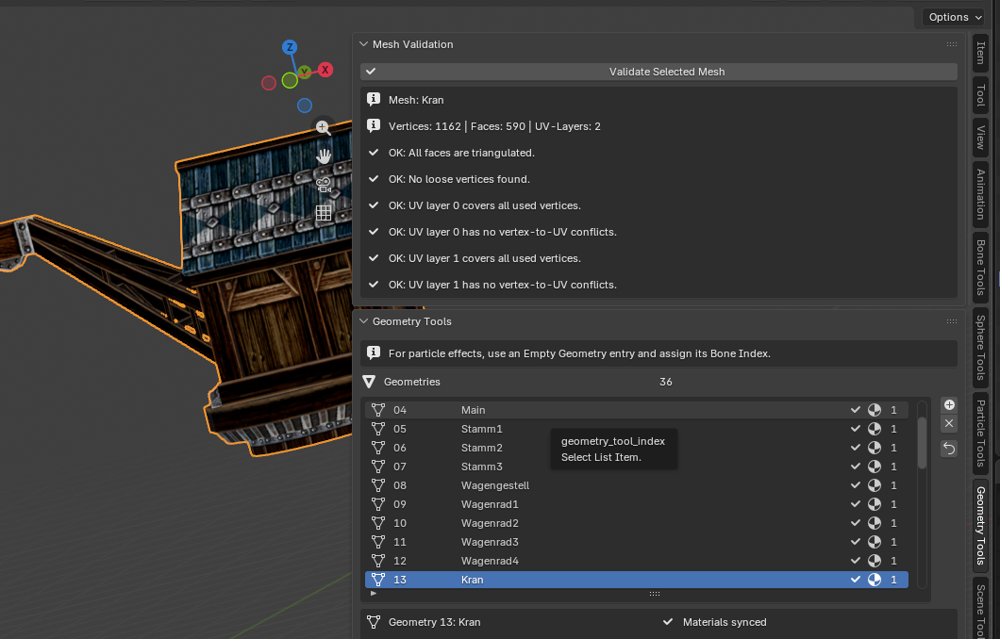

*Figure 7 — The selected PB_Factory `Kran` mesh appears beside its completed Mesh Validation report and the selected Geometry 13 record.*

## 6.3 UV and topology repair limits

UV Validation checks missing or excessive UV layers, non-finite values, inconsistent winding/normals, UV-to-vertex conflicts, and discontinuities without seams. **Fix UV** can mark seams, split vertices, sanitize invalid values, remove loose vertices, and recalculate normals. It does not triangulate faces or repair general non-manifold geometry. It refuses unsafe cases such as shape keys, missing UV data, structural mismatches, and meshes above the supported loop limit.

Any topology-changing fix invalidates the assumptions behind stored triangle indices, BinMesh groupings, and bounds. Always validate in the sequence used in the workflow above.

## 6.4 Workflow: synchronize and verify building materials

**Goal:** Make Blender material slots and Geometry Tools material metadata agree before export.

**Prerequisites:** A linked Geometry record, real Blender materials in every required slot, and known effect requirements such as snow or DualTex.

**Starting state:** Object Mode; intended mesh and matching Geometry row selected. Use `Main`, `Boden`, or `Kran` for the worked example.

**Menu path:** `3D Viewport > Sidebar (N) > Geometry Tools > Materials > Sync from Mesh`

1. Edit material assignments and slot order in Blender's Material Properties first.
2. Preserve polygon material indices when reordering slots.
3. Return to Geometry Tools and press **Sync from Mesh**.
4. Confirm that **Material Name** matches the Blender slot.
5. Review **UVTrans**, **DualTex**, **Ambient**, **Specular**, **Diffuse**, **Snow Texture**, and **Texture Alpha**.
6. Do not enable UVTrans and DualTex together unintentionally; current export gives UVTrans precedence.
7. Validate or regenerate BinMesh data after any slot/order/material-index change.
8. Export JSON and inspect the material/effect record before producing DFF.

**Expected result:** The Geometry material count and names match the linked mesh, while intentional effect metadata remains present.

**Verification:** PB_Factory `Main` should show `PB_Sawmill2`, DualTex on, UVTrans off, Ambient/Specular/Diffuse on, and Snow Texture `PB_snow1`. `Boden` should show `XB_Decals1` and `XB_Decals1_snow`. `Kran` should show `B_CB_SiegeEngineWorkshop_Yard` and `PB_snow1`.

**Recovery:** **Sync from Mesh** explicitly supports Undo, but building export also performs an automatic sync before later export stages. Those metadata mutations can remain even if export subsequently fails. Save before both manual synchronization and export, and reopen the previous backup if the synchronization was not intended.

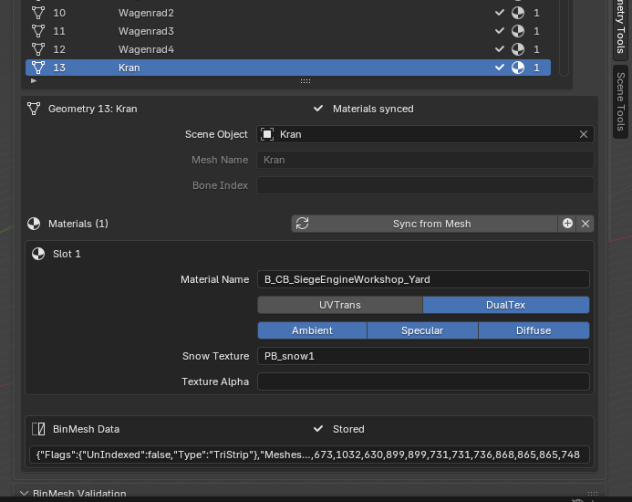

*Figure 8 — Geometry material detail for `Kran`, showing Geometry 13, the linked scene object, synchronized material name, DualTex, lighting flags, `PB_snow1`, texture alpha, and stored BinMesh state.*

# 7. Building Effects, Bounds, and Particles

## 7.1 Bone Manager and UserData effects

Bone Manager edits export metadata; it does not create or rename Blender bones.

- **Idx** is the frame/Atomic index string.
- **Num** is the HAnim node identifier string.
- **Mat** selects `Building` or `Decal`.
- **Tag** optionally writes or preserves `tag = <Bone Name>` with the effect.
- **Add Bone**, **Remove Bone**, and **Reset** do not explicitly register Undo and do not ask for confirmation.

`Building` writes the `SimpleObjectWithSnow` effect. `Decal` writes building-decal metadata including `BuildingDecalWithSnow` and `decal=flat`. Duplicate or contradictory rows are not comprehensively validated.

## 7.2 Workflow: inspect or edit a Bone Manager effect

**Goal:** Associate one building frame/HAnim node with the intended Building or Decal UserData effect.

**Prerequisites:** Known frame index, HAnim node ID, target bone, and effect semantics; a saved working copy.

**Starting state:** `Armature_Skin` and the relevant mesh are present. For the PB_Factory Building example, select `Kran`; for the Decal example, select `Boden`.

**Menu path:** `3D Viewport > Sidebar (N) > Bone Tools > Bone Manager`

1. Match the mesh's first vertex group to its bone name.
2. For `Kran`, confirm group `frame_062_615`, then select the row `Idx 62 / Num 615 / Building / Tag on`.
3. For `Boden`, confirm group `frame_002_604`, then select `Idx 2 / Num 604 / Decal / Tag off`.
4. Change only the field required by the intended effect. Both numeric-looking fields are free-form strings and accept invalid text.
5. Avoid duplicate frame/node mappings.
6. Export JSON and locate the corresponding UserData/effect record.
7. Re-import the resulting DFF in a clean file and confirm that the mapping survives.

**Expected result:** The target frame exports with one deliberate effect mapping and optional tag, while Blender bone topology remains unchanged.

**Verification:** PB_Factory contains exactly three mappings: `1/603 Building`, `2/604 Decal`, and `62/615 Building + Tag`. Compare exported JSON with these values rather than relying on the viewport appearance.

**Recovery:** Save before adding, removing, resetting, or editing rows. If a row is lost or altered incorrectly, reopen the previous `.blend`; do not expect Undo to restore the collection reliably.

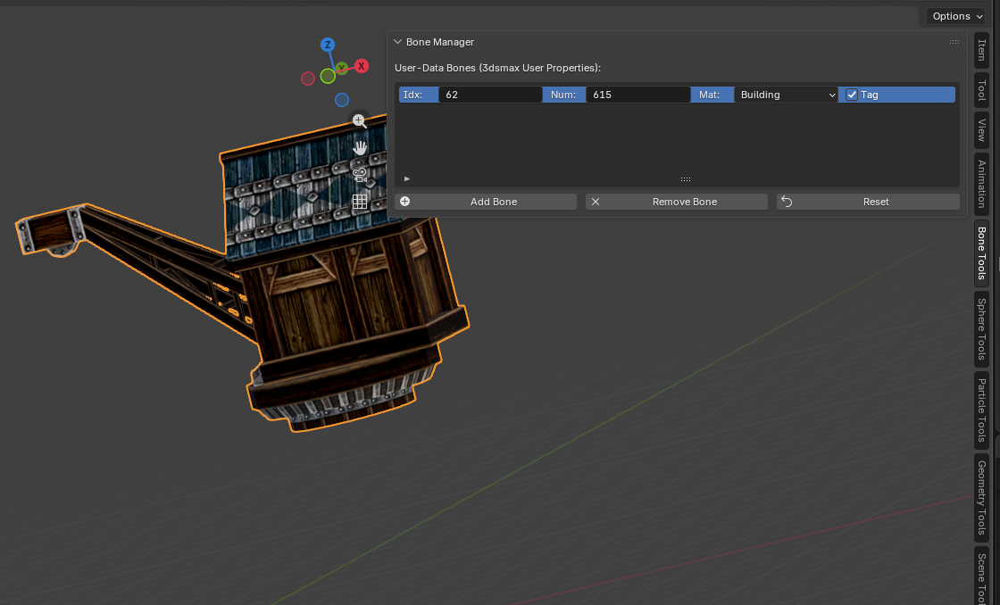

*Figure 9 — Bone Manager displays the `62 / 615 / Building / Tag` record while the associated `Kran` building mesh is visible in the 3D Viewport.*

## 7.3 Building export spheres

A building sphere stores a center and radius used as RenderWare bounds metadata. The implementation and round trip prove that bounds are exported; they do not prove a precise collision role in the game.

PB_Factory contains 36 helper sphere objects. A typical linked helper is named `<Mesh>_Sphere`, is parented to its Geometry mesh, uses wire display, is hidden in the viewport, and is excluded from rendering.

## 7.4 Workflow: inspect or rebuild a building sphere

**Goal:** Verify or regenerate bounds for one changed building mesh without confusing the helper with render geometry.

**Prerequisites:** Active linked mesh; first vertex group matching a building bone; valid `Armature_Skin`; saved backup.

**Starting state:** Object Mode; `Main` selected; Geometry row 04 selected; `Main_Sphere` hidden.

**Menu path:** `3D Viewport > Sidebar (N) > Sphere Tools > Sphere Menu`

1. Temporarily unhide only `Main_Sphere` in the Outliner and display it as wire.
2. Confirm that it is parented to `Main`, render-disabled, and linked by its sphere custom properties.
3. Re-hide it after inspection.
4. If `Main` topology changed, press **Generate** to open the X, Y, Z, and Radius dialog.
5. Review the proposed local display center and enclosing radius. Cancel if regeneration is not intended.
6. If regeneration is intended, confirm the dialog. The prior proxy-like child is deleted and replaced.
7. For changes affecting several meshes, use **Validate** to rebuild every linked Geometry sphere; this bulk operator explicitly supports Undo.
8. Export JSON and compare stored centers/radii, then inspect the re-imported helper.

**Expected result:** Every normal Geometry mesh has one current hidden bound helper, and the helper is not counted or edited as render topology.

**Verification:** The PB_Factory baseline has 36 Geometry records and 36 sphere/helper objects. The verified clean DFF re-import reproduced 36 spheres. Compare counts and linkage, not merely viewport size.

**Recovery:** **Generate** has no confirmation beyond its property dialog and no explicit Undo declaration. It can remove children matching broad proxy rules. Close without saving to recover an unintentionally replaced helper. **Validate All Spheres** supports Undo, but a saved backup remains safer.

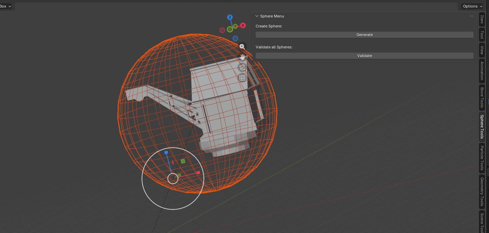

*Figure 10 — A PB_Factory sphere helper is visible as a selected wireframe bound around its building mesh while Sphere Tools is open.*

## 7.5 Particle-only Geometry records

Particle effects use a Particle Tools row and a corresponding zero-geometry frame. In PB_Factory:

- `PE_Smoke` has no vertices or faces, stores `Empty-Geometry`, uses group `frame_051_602`, and pairs with `Index 51 / smoke10`.
- `PE_Fire` has no vertices or faces, stores `Empty-Geometry`, uses group `frame_080_701`, and pairs with `Index 80 / fire01`.

## 7.6 Workflow: inspect or configure a particle effect

**Goal:** Pair one particle payload with the intended particle-only building frame.

**Prerequisites:** Known frame index and effect type; valid armature bone; saved backup; a fresh Blender session when comparing unrelated imported particle payloads.

**Starting state:** PB_Factory working copy; `PE_Smoke` or `PE_Fire` selected; matching Geometry row selected.

**Menu path:** `3D Viewport > Sidebar (N) > Geometry Tools` and `Particle Tools`

1. Select Geometry row **28** for `PE_Smoke` or row **36** for `PE_Fire`.
2. Confirm zero vertices/faces and the `Empty-Geometry` BinMesh state.
3. Confirm the first vertex group: `frame_051_602` for smoke or `frame_080_701` for fire.
4. Open Particle Tools and select `Index 51 / smoke10` or `Index 80 / fire01`.
5. For a new effect, create an Empty Geometry record, assign its controlling frame, then add a Particle row with the same frame index.
6. Choose a built-in type deliberately. Use `Ubisoft` only when retaining a payload found during import.
7. Export JSON and confirm that the particle payload is attached to the intended Atomic/frame.
8. Re-import the DFF in a fresh session before declaring the pair preserved.

**Expected result:** The particle record and zero-geometry frame agree on the intended frame index, with no render mesh or normal BinMesh data required.

**Verification:** Compare the two PB_Factory pairings above and ensure that ordinary Geometry totals are not inflated by helper sphere topology. The verified DFF re-import restored 36 Geometry records; verify the identities of the two particle-only records separately.

**Recovery:** Particle Add/Remove/Reset has no explicit Undo or confirmation. Imported `Ubisoft` payload state can remain in module-level caches even after **Clear Scene**. Close without saving and restart Blender to recover or isolate particle-state tests.

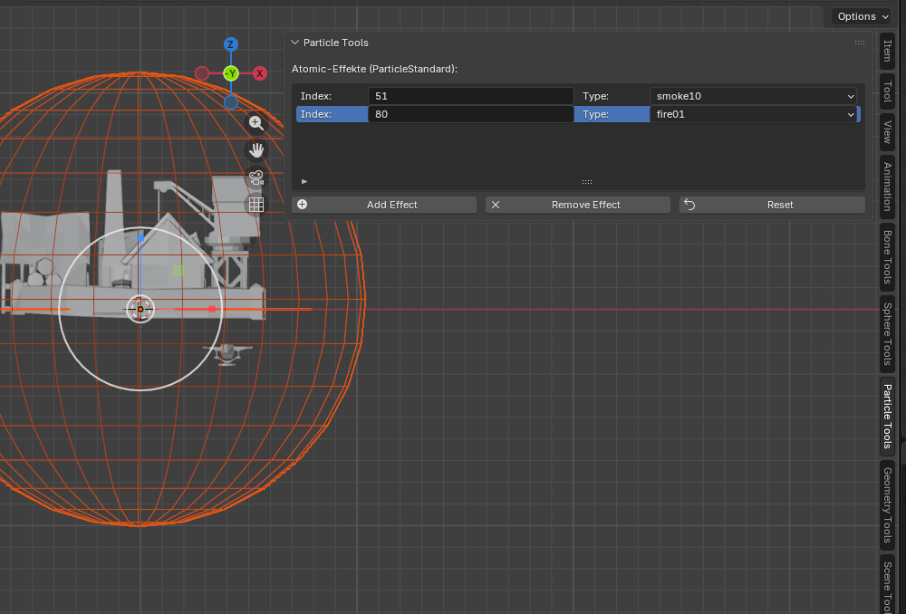

*Figure 11 — Particle Tools displays the PB_Factory particle indices 51 and 80 with the `smoke10` and `fire01` ParticleStandard types used by the particle-only Geometry relationships.*

# 8. Building Actions and Animation

## 8.1 Verified PB_Factory Action

`PB_Factory.blend` contains one Action named `Armature_SkinAction`:

- frame range `0–144`;
- scene playback rate 24 FPS;
- 30 F-curves;
- 150 keyframe points;
- key times `0`, `24`, `64`, `104`, and `144`;
- animated bones `frame_052_605`, `frame_053_606`, and `frame_054_607`;
- location, quaternion rotation, and scale curves for each animated bone;
- no NLA tracks;
- no stored `s5_*` Action custom metadata.

`frame_053_606` directly controls `Stamm_Moveable`, and `frame_054_607` directly controls `Hebel2`. `frame_052_605` participates in the animated hierarchy but is not the first vertex group of a Geometry mesh.

Current animation export writes translation and quaternion rotation. Do not assume that the Action's scale curves survive the ANM round trip.

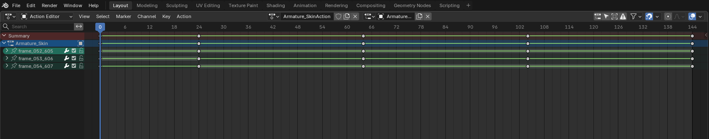

*Figure 12 — `Armature_SkinAction` in the Action Editor, with key times 0, 24, 64, 104, and 144 and the three animated frame bones visible.*

## 8.2 Workflow: review and edit a building Action

**Goal:** Inspect or adjust a building Action while preserving hierarchy, timing intent, and export root selection.

**Prerequisites:** Correct `Armature_Skin`; active Action; saved backup; known target FPS and root node.

**Starting state:** `Armature_Skin` active; Action Editor showing `Armature_SkinAction`; scene range 0–144 and current frame 0.

**Menu path:** `Dope Sheet > Editor Type: Action Editor`; sidebar tab `Animation Tool`

1. Confirm that `Armature_SkinAction` is active on `Armature_Skin`.
2. Expand the channels for `frame_052_605`, `frame_053_606`, and `frame_054_607`.
3. Verify the five key times and play the full 0–144 range.
4. Inspect `Stamm_Moveable` and `Hebel2` during playback to confirm that the expected rigid parts move.
5. Do not rename or reparent the animated bones.
6. Avoid relying on scale keys; the current exporter emits translation and quaternion rotation.
7. Record that the saved scene is 24 FPS and the Action has no stored add-on FPS/type/export-name metadata.
8. Open the Animation Tool sidebar only for documentation: in Blender 5.0.1 the populated panel can show `UI-Fehler im Animation Tool.` because its draw code attempts an ID-property write.
9. Until that panel defect is fixed, do not claim its FPS, Anim-Type, Start-Prev-Keyframe, or Apply FPS controls are normally usable.

**Expected result:** The Action plays over frames 0–144 with its three animated frame channels intact, and any edit remains localized to the intended keys.

**Verification:** Compare channel count, key times, frame range, and visible part motion. Exported ANM should later be re-imported onto a clean matching rig and compared over the entire range.

**Recovery:** Save before retiming or changing keys. **Apply FPS** has no explicit Undo declaration, and it rescales keyframe and handle times rather than only changing playback rate. Close without saving and reopen the backup after an unintended retime.

## 8.3 Workflow: import a building animation

**Goal:** Load a building `.anm` or animation JSON onto the matching building armature as a new Action.

**Prerequisites:** Matching building model and hierarchy already loaded; active `Armature_Skin`; source `.anm` or compatible `.json`; backup.

**Starting state:** Object or Pose Mode; intended building armature active; existing Action and NLA state recorded.

**Menu path:** `File > Import > Novator-Import-Buidling-Anm (.anm/.json)`

1. Select the animation file and import it.
2. Confirm that the add-on created a uniquely named Action and made it active.
3. Inspect muted NLA tracks; the previous Action can be stashed there.
4. Confirm frame range, key timing, root motion, and animated bone alignment.
5. Play the complete Action on the matching building.
6. Check the System Console for converter or hierarchy warnings.
7. Save the result under a new `.blend` name.

**Expected result:** A new active Action drives the matching building rig without changing the rest hierarchy.

**Verification:** Compare the imported Action against the source JSON or a known reference: Action name, range, FPS intent, animated nodes, translations, quaternions, and visible playback. Building import supports HierarchicalAnim and converter `nodes[]` input; do not use CompressedAnim as a building-import expectation.

**Recovery:** If the wrong armature was used or tracks do not align, close without saving. Reopen the clean model, explicitly select the intended armature, and import once. Do not stack repeated diagnostic imports in one scene.

## 8.4 Root selection and timing cautions

Animation filenames ending in `_500` through `_599`, or in `_600` or higher, can force root selection. A valid but wrong suffix can therefore choose the wrong subtree. Without a qualifying suffix, the building exporter attempts automatic hierarchy selection.

For the verified PB_Factory animation export, the Action name had no numeric root suffix and automatic root resolution selected node ID **603**. This is a verified result for this hierarchy, not a universal root value.

The PB_Factory source scene uses 24 FPS, while add-on defaults and many game animations use 30 FPS. The successful file/re-import test establishes a 0–144 Action range, not correct in-game duration. Timing must be checked independently in Blender and in the game.

# 9. Exporting Buildings and Verified Round Trips

## 9.1 Preparation checklist

Before either model or animation export:

1. Work from an incremented `.blend` copy.
2. Return to Object Mode for model export.
3. Select `Armature_Skin` explicitly; exporter fallback to another armature is not a substitute for correct context.
4. Confirm Geometry row/object alignment.
5. Resolve all Mesh, UV, and BinMesh errors.
6. Rebuild spheres after topology changes.
7. Confirm Bone Manager and Particle Tool mappings.
8. Export JSON first and inspect it.
9. Use a new destination filename and an empty directory for batch output.

Building model export automatically synchronizes Geometry material metadata before constructing the payload. The synchronization mutates the working scene and can remain even if a later export stage fails.

## 9.2 Workflow: export a building model

**Goal:** Export the configured building as inspectable JSON and binary DFF, then verify a clean re-import.

**Prerequisites:** Valid `Armature_Skin`; 36 linked PB_Factory Geometry records; assigned materials; triangular meshes; current UV, BinMesh, effect, particle, and sphere data; saved backup.

**Starting state:** Object Mode; `Armature_Skin` explicitly active; no validation errors; output directory empty or clearly separated from source assets.

**Menu path:** `File > Export > Novator-Export-Buidling (.dff/.json)`

1. Choose **Format: .json** and a new filename.
2. Export and inspect the System Console and resulting file size.
3. Parse or review the JSON for the expected frame hierarchy, 36 Geometry records, materials, BinMesh data, effect rows, particles, and sphere bounds.
4. Reopen the export dialog and choose **Format: .dff**. The extension updates automatically.
5. Export to a new DFF filename and confirm that a non-empty file exists.
6. Start a new disposable Blender file with the add-on registered.
7. Import the exported DFF with the building importer.
8. Record object, armature, bone, Geometry, topology, material, particle, effect, and sphere counts.
9. Compare the visible model and hierarchy with the working source.

**Expected result:** For the verified PB_Factory run, JSON export creates **8,673,678 bytes**, DFF export creates **468,825 bytes**, and the clean DFF re-import completes successfully.

**Verification:** The verified re-import reproduced **73 objects**, **82 bones**, **36 Geometry records**, **9,200 Geometry vertices**, **5,660 Geometry faces**, and **36 spheres**. These equality checks are structural acceptance criteria, not proof of byte-for-byte identity or in-game correctness.

**Recovery:** Blender Undo does not remove external output files. If automatic material synchronization was unwanted, close without saving and reopen the backup. Delete an unwanted output only after confirming its exact absolute path; never overwrite the source game asset during diagnosis.

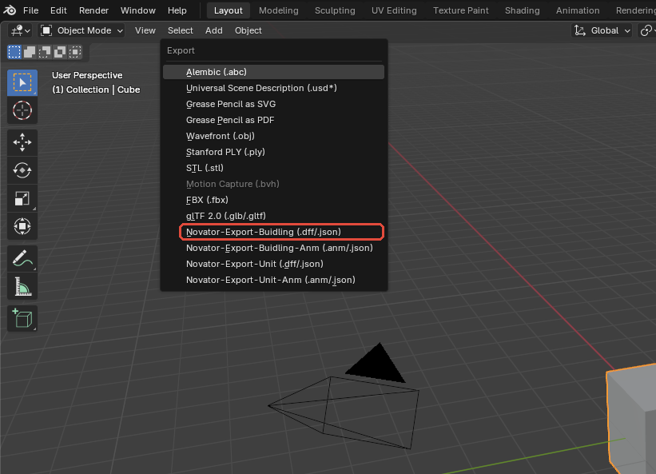

*Figure 13 — The editorial red outline marks the Blender 5.0.1 Building model export command used to begin PB_Factory JSON or DFF export; the format is selected in the file browser that follows.*

## 9.3 Workflow: export a building animation

**Goal:** Export the active PB_Factory Action as JSON and ANM and verify that the ANM can be re-imported onto a clean matching rig.

**Prerequisites:** Matching `Armature_Skin`; `Armature_SkinAction` active; hierarchy and root reviewed; known timing caveat; empty output directory; saved backup.

**Starting state:** Action Editor shows `Armature_SkinAction`; armature active; frame range 0–144; intended export scope is Active Action.

**Menu path:** `File > Export > Novator-Export-Buidling-Anm (.anm/.json)`

1. Choose **Format: .json** and **Actions: Active Action**.
2. Export to a new filename and inspect the JSON for root, frame/node records, translation, and quaternion data.
3. Confirm that automatic root resolution selected node ID **603**.
4. Reopen the export dialog, choose **Format: .anm**, retain **Active Action**, and export to a new file.
5. Confirm that the ANM exists and is non-empty; read the console even if Blender reports success.
6. Open a clean copy of the matching PB_Factory rig.
7. Import the exported ANM with the building animation importer.
8. Confirm the re-imported Action range and play every frame.
9. Compare animated bones, root motion, rigid-part motion, and timing with the source Action.

**Expected result:** The verified PB_Factory run created a **2,652,031-byte JSON** animation and a **167,612-byte ANM**. ANM re-import passed and produced an Action with range **0–144**.

**Verification:** Require all of the following: non-empty files; no unreviewed console exception; root ID 603; re-imported range 0–144; matching animated hierarchy; and visually plausible playback. The test did not establish preservation of scale curves or correct game-time duration.

**Recovery:** Animation export files are external and not undoable. The ANM conversion helper does not reliably reject every nonzero converter result or empty output, so a success notification is not recovery evidence. Retain JSON, isolate partial batch files, and reopen the saved `.blend` if Action switching or timing changed unexpectedly.


*Figure 14 — The Action Editor preflight shows `Armature_SkinAction`, its three animated frame bones, and the verified 0–144 timing before the Building-Anm exporter is opened.*

## 9.4 Workflow: round-trip acceptance review

**Goal:** Decide whether the PB_Factory export is structurally acceptable for further isolated in-game testing.

**Prerequisites:** Source working copy; exported JSON, DFF, animation JSON, and ANM; clean model and animation re-import scenes; recorded baseline counts.

**Starting state:** No source and re-imported assets are mixed in one scene. Outputs retain distinct filenames.

**Menu path:** Model: `File > Import > Novator-Import-Buidling (.dff/.json)`; animation: `File > Import > Novator-Import-Buidling-Anm (.anm/.json)`

1. Compare source and re-import model object counts.
2. Compare armature name, root, bone count, and hierarchy.
3. Compare Geometry count, mesh names, vertex/face totals, material assignments, and UV layers.
4. Compare Bone Manager, particle, Empty Geometry, BinMesh, and sphere state.
5. Compare Action name/range, root ID, animated bones, key timing, and visible playback.
6. Record every difference rather than assuming it is harmless.
7. Only after structural acceptance, test a copy in a legal isolated game/mod setup.

**Expected result:** The verified PB_Factory integration path passes model JSON/DFF creation, clean DFF re-import with matching principal counts, animation JSON/ANM creation, and ANM re-import with range 0–144.

**Verification:** Use this verified evidence table:

| Operation | Result | Evidence |
|---|---|---:|
| Building JSON export | PASS | 8,673,678 bytes |
| Building DFF export | PASS | 468,825 bytes |
| Clean DFF re-import | PASS | 73 objects; 82 bones; 36 Geometry records; 9,200 vertices; 5,660 faces; 36 spheres |
| Building animation JSON export | PASS | 2,652,031 bytes; automatic root 603 |
| Building ANM export | PASS | 167,612 bytes |
| ANM re-import | PASS | Action range 0–144 |

**Recovery:** Preserve the source and every diagnostic JSON. If any comparison fails, stop before in-game use, archive the failing outputs and console log, return to the last known-good `.blend`, correct one issue at a time, and repeat the complete clean round trip.

## 9.5 What the verified round trip does not prove

The PASS results above are deliberately narrow. They prove that the tested Blender operators completed, that non-empty files with the stated sizes were created, and that the stated structure was observed after clean re-import. They do not prove:

- byte-for-byte equality with an original Ubisoft asset;
- identical texture lookup, shading, or snow/decal appearance;
- correct culling or collision behavior;
- correct particle appearance in the game;
- scale-animation preservation;
- correct animation duration at the game's playback rate;
- gameplay logic or selection behavior;
- compatibility with other buildings, converter versions, Blender versions, or add-on revisions.

Treat clean re-import as the minimum integration check and an isolated in-game test as a separate final validation stage.

# Part III - Units

This part follows the complete building workflow and covers deformable, skinned units. The verified example is `docs/handbook/_test/pu_leadersword4.dff`, imported with Novator12 DFF Plugin Blender v5 3.2.1 in Blender 5.0.1.

The verified evidence is deliberately limited. Original DFF import and JSON model export were tested. DFF export failed at the bundled converter's `NumBones` schema boundary. No matching unit ANM was supplied, so no unit-animation import, edit, export, or round trip is reported as tested in this part.

# 10. Unit Workflow Overview

## 10.1 How a unit differs from a building

A unit is a deformable skinned model rather than a collection of rigid Geometry records. Its central relationships are:

1. `Armature_UnitSkin` supplies the frame and HAnim hierarchy.
2. The body mesh uses an Armature modifier targeting that armature.
3. Vertex groups named after imported frame bones provide the skin influences.
4. The imported SkinPLG payload stores bone mapping, inverse matrices, and weight-related data.
5. Imported triangle, BinMesh, Atomic, material, and UserData payloads preserve converter-facing state.
6. A separately marked selection sphere supplies unit selection/bounds metadata.
7. A matching unit animation, when available, becomes a Blender Action on the armature.

The safe order is:

`import in isolation → select the body instead of the sphere → inspect rig/modifier/groups → make topology-preserving edits → audit weights → preserve the selection sphere → inspect/export JSON → attempt binary conversion only as a controlled test → clean re-import → isolated in-game test`

Unit import does not populate Geometry Tools, Bone Manager, or Particle Tools. Their building-oriented bulk operations must not be assumed to cover the imported body.

## 10.2 Verified pu_leadersword4 inventory

| Area | Verified imported state |
|---|---:|
| Objects | 3 |
| Armature | 1 (`Armature_UnitSkin`) |
| Armature bones | 41; root `frame_000` |
| Mesh objects | 2: body and selection sphere |
| Body vertices | 752 |
| Body edges | 1,622 |
| Body faces | 905 triangles |
| UV layers | 1 (`Float2`) |
| Assigned asset materials | 1 (`Pu_LeaderSword4`) |
| Vertex groups | 39 |
| Maximum positive influences per vertex | 2 |
| Vertices with more than four influences | 0 |
| Unweighted body vertices | 0 |
| Observed weight sums | Approximately 1.0 |
| Actions | 0 |
| Geometry/Bone/Particle tool records | 0 / 0 / 0 |

The largest group by affected-vertex count is `frame_021_1001`, which influences 173 vertices. This makes it the preferred Weight Paint teaching example.

The body object is named `pu_leadersword4`. It is at location zero and scale one, has one Armature modifier targeting `Armature_UnitSkin`, and preserves imported custom payloads such as stored triangles, BinMesh, SkinPLG, Atomic extension, and Geometry UserData.

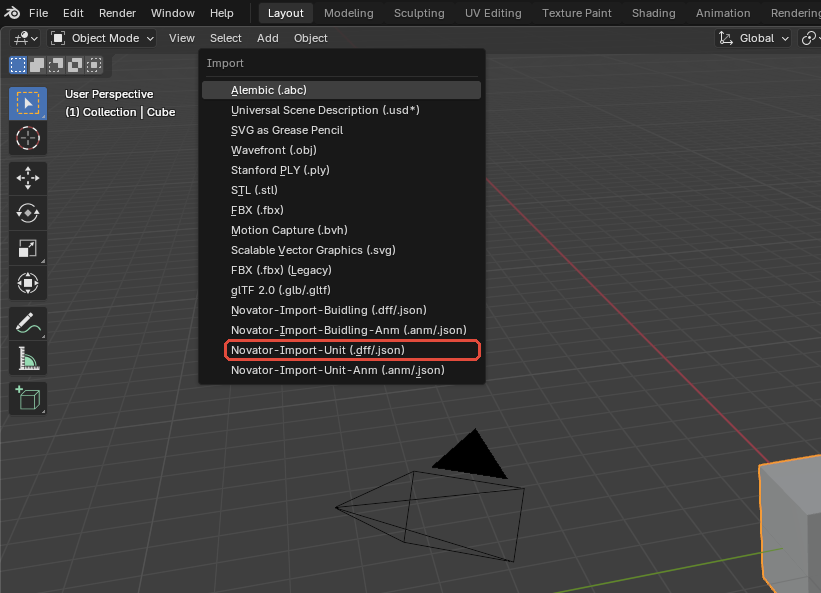

*Figure 15 — The editorial red outline marks **Novator-Import-Unit (.dff/.json)**, the command used to select `pu_leadersword4.dff`; DFF is the binary path and JSON bypasses conversion.*


*Figure 16 — The imported `pu_leadersword4` body mesh is shown in the Blender 5.0.1 3D Viewport before mesh, rig, and sphere inspection.*

## 10.3 Workflow: establish a safe unit working copy

**Goal:** Create a reproducible workspace in which the imported unit can be inspected without risking the original DFF or unrelated Blender data.

**Prerequisites:** Blender 5.0.1; add-on 3.2.1; bundled `S5Converter.exe`; lowercase source file `pu_leadersword4.dff`; a writable project folder.

**Starting state:** New expendable `.blend`; no other game asset loaded; original DFF retained unchanged.

**Menu path:** `File > Save As`, followed by the Unit import path in Chapter 11.

1. Save the empty Blender scene as an initial working file.
2. Import only `pu_leadersword4.dff` with the Unit importer.
3. Save the imported result under an incremented name.
4. Record the three-object inventory and body counts before editing.
5. In the Outliner, distinguish the body, armature, and selection sphere.
6. Select the body explicitly because the importer leaves the selection sphere active.
7. Keep a second untouched imported `.blend` for later comparison.

**Expected result:** Two saved Blender copies exist: an untouched imported baseline and a separate editing copy. The original DFF remains unchanged.

**Verification:** Confirm three imported objects, 41 bones, 752 body vertices, 905 body triangles, 39 groups, one body material, and no Actions or add-on Geometry/Bone/Particle records.

**Recovery:** If the import or initial inspection state becomes unclear, close without saving and return to the untouched imported baseline. Do not use **Clear Scene** in a valuable or multi-scene file.

# 11. Importing pu_leadersword4

## 11.1 Unit importer behavior

Use the Unit importer, not the building importer. Binary DFF input passes through `S5Converter.exe`; converter-compatible JSON can be loaded directly. Import is additive and changes the viewport clipping range for game-scale assets.

The importer creates:

- `Armature_UnitSkin` with the imported frame hierarchy;
- the skinned body mesh and its Armature modifier;
- bone-named vertex groups and normalized imported weights;
- retained unit-specific custom payloads;
- a child object marked `s5_sphere_type = "SelectionSphere"`.

It does not create Geometry Tools rows. A blank Geometry list after this import is the verified expected state, not evidence that the body is missing.

## 11.2 Workflow: import pu_leadersword4.dff

**Goal:** Import the original unit DFF and verify its rig, skinned body, material, and selection sphere.

**Prerequisites:** New saved Blender file; add-on registered; converter beside the add-on; readable `docs/handbook/_test/pu_leadersword4.dff`.

**Starting state:** Object Mode in an otherwise empty scene. No existing armature or tool records.

**Menu path:** `File > Import > Novator-Import-Unit (.dff/.json)`

1. Select the lowercase `pu_leadersword4.dff` file.
2. Press the file browser's import button and wait for Blender to return to the 3D Viewport.
3. Read the System Console and confirm that the operator completed without a converter exception.
4. In the Outliner, confirm `Armature_UnitSkin`, `pu_leadersword4`, and `pu_leadersword4_SelectionSphere`.
5. Note that `pu_leadersword4_SelectionSphere` is the active selected object immediately after import.
6. Select `pu_leadersword4` before opening mesh, modifier, material, or weight controls.
7. Inspect the Armature modifier target and one or more vertex groups.
8. Open Geometry Tools and record that its list is empty.
9. Save as a new `.blend` working copy.

**Expected result:** The importer returns `FINISHED` and creates one 41-bone armature, one triangular skinned body, and one marked selection-sphere child.

**Verification:** Confirm the verified counts: body 752 vertices, 1,622 edges, 905 triangular faces, one `Float2` UV layer, one `Pu_LeaderSword4` material slot, 39 vertex groups, and no active Action.

**Recovery:** If duplicate objects or tool state exist, close without saving and repeat the import in a new scene. Imports do not clear prior content, so deleting only visible objects is not a reliable clean-state substitute.

## 11.3 Initial inspection notes

The imported body dimensions are approximately `93.668 × 86.151 × 194.199` Blender units. The body is at location `(0, 0, 0)` and scale `(1, 1, 1)`. These values are evidence for this sample only and are not universal unit dimensions.

The material slot references `Pu_LeaderSword4`. The imported material in the audited state has a Principled BSDF and Material Output but no resolved Image Texture node. A gray or untextured viewport appearance therefore does not by itself indicate that the DFF failed to import.

# 12. Editing the Unit Mesh, Rig, and Weights

## 12.1 Safe and unsafe edit boundaries

The safest unit edits preserve topology and data identity:

- Move existing vertices without adding, deleting, merging, subdividing, or reordering them.
- Preserve polygon material indices and material-slot order.
- Preserve the Armature modifier and its target.
- Preserve armature hierarchy, bone names, and rest relationships.
- Preserve bone-named vertex groups.
- Keep no more than four meaningful positive influences per vertex.

Imported unit data can include stored `s5_triangles` and BinMesh/SkinPLG payloads. Current export can prefer stored triangles over rebuilding them from the current Blender polygons. Topology or material-index changes can therefore disappear from output or invalidate the payload. Ordinary Blender material edits may also be superseded by imported converter-facing material state where present.

Unapplied modifiers are not a general evaluated export pipeline. Do not assume Mirror, Subdivision, Geometry Nodes, or deformations visible only through modifiers will appear in exported DFF data.

## 12.2 Workflow: make a topology-preserving mesh edit

**Goal:** Adjust the existing body shape while preserving stored triangle indices, skin relationships, UVs, and material assignment.

**Prerequisites:** Incremented working copy; body selected; baseline counts recorded; understood effect of the intended edit.

**Starting state:** `pu_leadersword4` active in Object Mode; selection sphere hidden or deselected; Armature modifier retained.

**Menu path:** `3D Viewport > Object Mode > Tab: Edit Mode`

1. Confirm that the active object is `pu_leadersword4`, not the selection sphere.
2. Record 752 vertices, 905 faces, one UV layer, and one material slot.
3. Enter Edit Mode and move only the required existing vertices.
4. Do not add, delete, merge, subdivide, triangulate again, or reorder geometry.
5. Preserve UV coordinates unless the intended change requires a controlled UV adjustment.
6. Return to Object Mode and verify that the Armature modifier still targets `Armature_UnitSkin`.
7. Pose a nearby bone briefly to inspect deformation, then return the armature to its rest pose.
8. Export JSON to a new filename and compare stored triangle, skin, and geometry information with the baseline.

**Expected result:** The visual shape changes while vertex count, triangle count, UV-layer count, material-slot order, modifier target, and group identities remain unchanged.

**Verification:** Require exactly 752 vertices and 905 triangles after the edit. Compare all modified vertex positions deliberately and confirm that no unweighted vertices were introduced.

**Recovery:** Undo ordinary Edit Mode moves when possible. If topology or indices changed, close without saving and reopen the last incremented copy; rebuilding only the visible polygons does not guarantee repair of stored converter metadata.

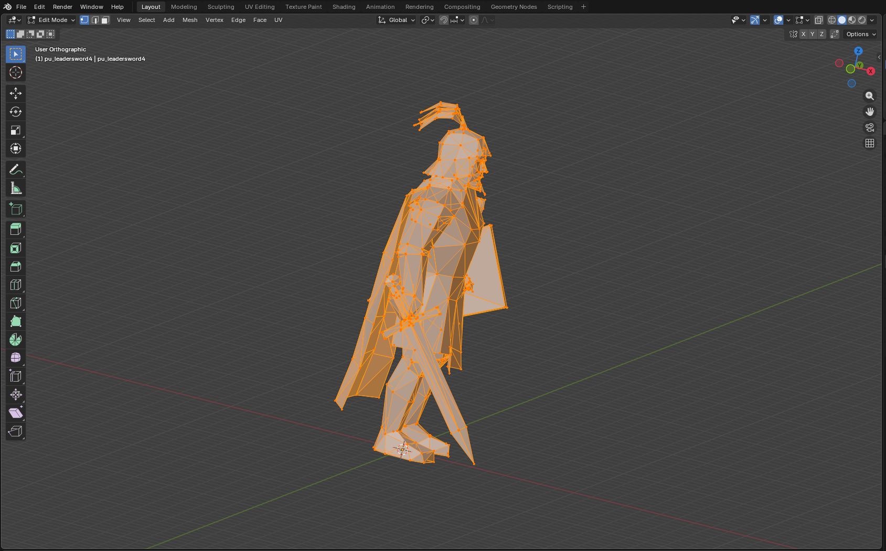

*Figure 17 — The body in Edit Mode with vertices, edges, and triangular faces visible. The selection sphere is excluded from the topology demonstration.*

## 12.3 Armature, bones, and the Armature modifier

`Armature_UnitSkin` contains 41 bones beneath `frame_000`. Bone names encode imported frame indices and HAnim node identifiers. The body has 39 matching vertex groups; root or structural bones do not necessarily require a deform group.

The body is not parented directly to the armature in the audited state. Deformation is supplied by its Armature modifier, whose target is `Armature_UnitSkin`. Do not replace that relationship with simple object parenting.

## 12.4 Workflow: inspect the rig without changing the rest hierarchy

**Goal:** Verify bone hierarchy, modifier target, and group-to-bone correspondence before weight or animation work.

**Prerequisites:** Clean imported baseline or saved editing copy; body and armature visible.

**Starting state:** Object Mode; no Action; body at imported transforms; armature in Rest Position.

**Menu path:** Body: `Properties > Modifiers`; armature: `3D Viewport > Pose Mode` and `Armature Data Properties`

1. Select `pu_leadersword4` and inspect its Armature modifier.
2. Confirm target `Armature_UnitSkin`.
3. Inspect the 39 body vertex-group names.
4. Select `Armature_UnitSkin` and confirm 41 bones and root `frame_000`.
5. Compare representative group names with matching bones, including `frame_021_1001`.
6. Enter Pose Mode and rotate one bone slightly to test deformation.
7. Clear the pose and return to the rest state.
8. Do not rename, delete, insert, reparent, or reorder bones during inspection.

**Expected result:** The body deforms through the existing modifier and bone-named groups while the imported 41-bone hierarchy remains unchanged.

**Verification:** Confirm that every one of the 39 deform group names resolves to an armature bone. Check that no modifier target changed and no Action was unintentionally created.

**Recovery:** Clear test poses with Blender's pose-clear commands. If the rest pose, hierarchy, or names were edited, close without saving and reopen the baseline; Pose Mode Undo is not a substitute for recovering an altered bind hierarchy.


*Figure 18 — `Armature_UnitSkin` in Pose Mode exposes the imported unit-bone hierarchy through the body mesh.*

## 12.5 Weight behavior

The audited body is a clean, useful weight example:

- 39 vertex groups;
- no unweighted body vertices;
- no vertex with more than two positive influences;
- observed positive-weight sums between approximately `0.99999997` and `1.00000003`;
- largest group `frame_021_1001`, influencing 173 vertices.

The exporter retains at most the four strongest positive influences that map to valid armature bones and then normalizes them. Unknown groups are ignored. A vertex with no valid influence can reach export with zeroed indices/weights because the add-on does not enforce a mandatory unweighted-vertex validation pass.

## 12.6 Workflow: inspect or adjust unit weights

**Goal:** Make a controlled weight change while staying within the exporter's four-influence limit and preserving full vertex coverage.

**Prerequisites:** Body and matching armature; saved baseline; no unintended topology change.

**Starting state:** Body selected; `Armature_UnitSkin` available; group `frame_021_1001` chosen as the teaching example.

**Menu path:** `3D Viewport > Mode > Weight Paint`; body `Object Data Properties > Vertex Groups`

1. Select `pu_leadersword4` and activate group `frame_021_1001`.
2. Enter Weight Paint Mode and inspect the 173 influenced vertices.
3. Make only the required local weight adjustment.
4. Normalize weights and limit total influences to four or fewer.
5. Confirm that group names still match real bones.
6. Audit all vertices for at least one valid positive influence.
7. Pose the affected bone and neighboring bones to inspect deformation.
8. Clear the pose, return to Object Mode, and export diagnostic JSON.

**Expected result:** The intended deformation changes while all 752 body vertices remain weighted, no vertex exceeds four valid influences, and weight sums remain normalized.

**Verification:** Compare against the imported baseline: maximum two influences and zero unweighted vertices before editing. If the edit intentionally raises a vertex above two influences, record it and still require no more than four.

**Recovery:** Save before normalization or bulk weight operations. If coverage, group identity, or deformation becomes uncertain, reopen the baseline and repaint the smallest affected region rather than trying to reconstruct imported weights from appearance alone.

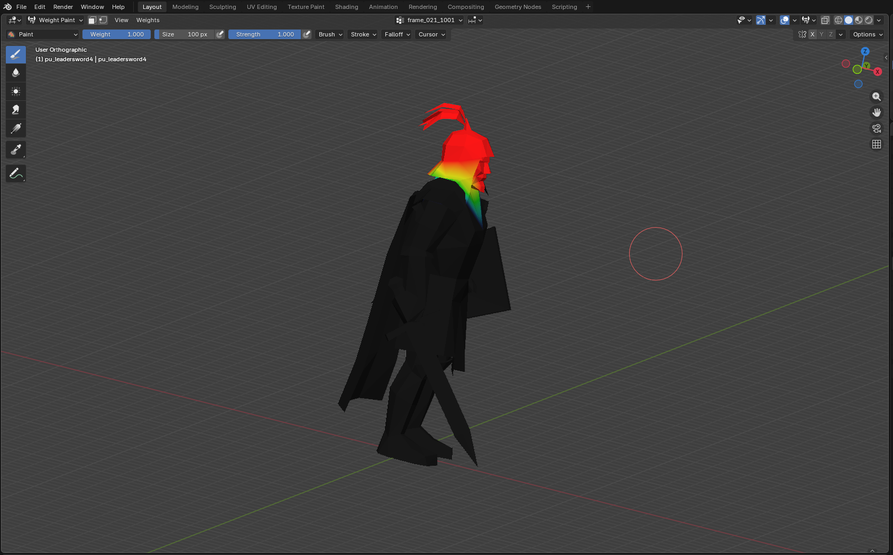

*Figure 19 — Weight Paint Mode with `frame_021_1001` active displays the group's broad influence region across the unit's head and upper body.*

# 13. Unit Selection Sphere and Animations

## 13.1 Verified selection-sphere state

The imported helper is `pu_leadersword4_SelectionSphere`:

- parent: `pu_leadersword4`;
- custom marker: `s5_sphere_type = "SelectionSphere"`;
- location approximately `(-10.89182, -9.13994, 95.48524)`;
- dimensions approximately `(218.20874, 218.20868, 218.20883)`;
- scale `(1, 1, 1)`;
- render disabled;
- 482 helper vertices and 512 sphere faces, which produce 960 display triangles.

The sphere is not body geometry. Its non-triangular helper faces must not be used to claim that the 905-face body failed triangulation.

Unit export identifies the sphere by the `SelectionSphere` marker and reads its current location and X dimension. Keep dimensions uniform. Sphere Tools **Generate** creates a building-style proxy without this marker and is not a valid replacement.

## 13.2 Workflow: inspect or adjust the unit selection sphere

**Goal:** Preserve or deliberately adjust unit selection metadata without altering the skinned body or substituting a building sphere.

**Prerequisites:** Imported unit working copy; marked sphere present; known reason for any requested bounds change.

**Starting state:** Object Mode; `pu_leadersword4_SelectionSphere` selected; body and armature unchanged.

**Menu path:** `Outliner > pu_leadersword4 > pu_leadersword4_SelectionSphere`; `Object Properties > Transform` and `Custom Properties`

1. Confirm the parent is `pu_leadersword4`.
2. Confirm `s5_sphere_type` equals `SelectionSphere` exactly.
3. Record the imported location and dimensions shown above.
4. Enable wire display if the sphere obscures the body.
5. If a change is required, move the sphere in Object Mode and scale it uniformly.
6. Do not rename away the marker, apply non-uniform scale, triangulate the helper, or use Sphere Tools Generate.
7. Export JSON and compare the serialized selection-sphere center and size with the intended values.

**Expected result:** One marked, parented, render-disabled selection sphere remains associated with the body, with deliberate uniform dimensions.

**Verification:** Require the exact marker, parent, one-sphere count, and expected location/X dimension. A visually similar unmarked UV sphere is not equivalent.

**Recovery:** Undo a simple transform or reopen the baseline. If the marked sphere was deleted, do not improvise a replacement with building Sphere Tools; restore it from the untouched import or implement and test the required marker/linkage deliberately.

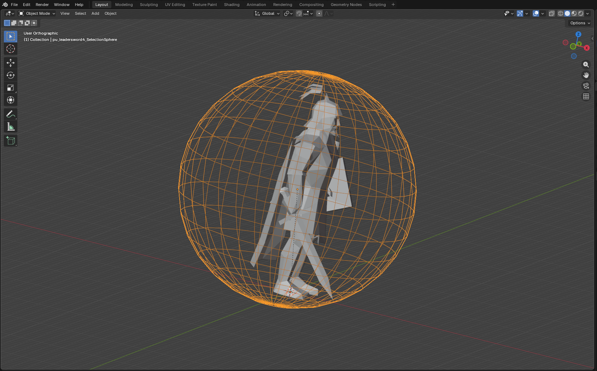

*Figure 20 — The selected `pu_leadersword4_SelectionSphere` wireframe surrounds the imported unit in the 3D Viewport.*

## 13.3 Animation test scope

No matching animation file was supplied for `pu_leadersword4.dff`. The imported model contains no Action, and the audited scene retained Blender's default 24 FPS and frame range 1–250. Consequently:

- no unit ANM was imported;
- no Action-to-rig compatibility was tested;
- no unit animation JSON or ANM was exported;
- no unit ANM was re-imported;
- no animation was played or tested in the game.

The workflows below describe the current add-on interface and source-defined behavior only. They are not PASS results for this sample.

## 13.4 Workflow: import and inspect a matching unit animation - untested for this sample

**Goal:** Load a separately supplied animation onto the matching unit rig and establish whether its hierarchy and timing are compatible.

**Prerequisites:** A genuine animation intended for this exact 41-bone hierarchy; untouched model baseline; active `Armature_UnitSkin`; backup. These prerequisites were not available during the audit.

**Starting state:** Object or Pose Mode; `Armature_UnitSkin` active; no current Action; source animation retained unchanged.

**Menu path:** `File > Import > Novator-Import-Unit-Anm (.anm/.json)`

1. Verify the animation's intended model and root before importing it.
2. Select `Armature_UnitSkin` explicitly.
3. Import the `.anm` or compatible animation `.json`.
4. Confirm that a new uniquely named Action becomes active.
5. Record frame range, FPS metadata, animation type, node count, and root.
6. Inspect muted NLA tracks because prior Actions can be stashed there.
7. Play the complete range and inspect the body for root-motion, hierarchy, or deformation errors.
8. Compare translation and quaternion channels with the source. Do not assume scale animation will export.
9. Save the animation test in a new `.blend` file.

**Expected result:** If the supplied animation is compatible, one new Action drives the matching bones without changing the rest hierarchy. No such result is claimed for `pu_leadersword4` in this handbook revision.

**Verification:** A future test must record operator result, Action name/range, FPS, root, animated bone/channel counts, visible playback, console output, and clean re-import evidence.

**Recovery:** If the wrong rig or animation was used, close without saving and return to the untouched model. Do not repeatedly import alternatives into one diagnostic scene because Actions and muted NLA tracks can accumulate.

## 13.5 Workflow: export a unit animation - untested for this sample

**Goal:** Export one verified compatible Action as diagnostic JSON and then ANM.

**Prerequisites:** A successfully imported or authored matching Action; verified root and timing; active armature; empty output directory; saved backup. No such Action was supplied for the audit.

**Starting state:** Action Editor shows the intended Action on `Armature_UnitSkin`; export scope set to Active Action.

**Menu path:** `File > Export > Novator-Export-Unit-Anm (.anm/.json)`

1. Choose **Format: .json** and **Actions: Active Action**.
2. Export and inspect root, nodes, translation, and quaternion data.
3. Confirm that the intended root was selected; a qualifying numeric filename suffix can override fallback root logic.
4. Export **Format: .anm** to a new file.
5. Confirm a non-empty file and review the console.
6. Import the generated ANM onto a clean copy of the matching rig.
7. Compare Action range, hierarchy, root motion, and every visible deformation.

**Expected result:** A future compatible test may produce JSON/ANM and a re-importable Action. No output size or PASS status is stated here because this workflow was not run for `pu_leadersword4`.

**Verification:** Require clean ANM re-import and full-range playback. Do not treat a Blender success message or non-empty file alone as proof; the ANM conversion helper has incomplete return/empty-output checks.

**Recovery:** External files are not removed by Undo. Keep outputs isolated, retain diagnostic JSON, and remove partial files only after confirming their exact directory. Reopen the saved `.blend` after unintended Action switching or timing changes.

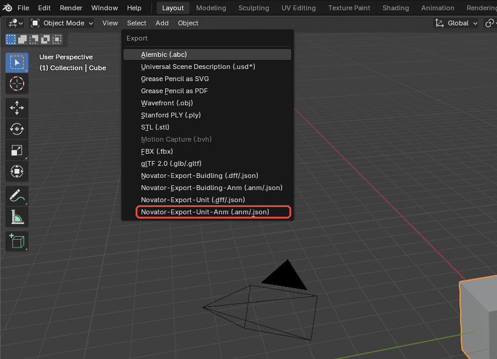

*Figure 21 — The editorial red outline marks **Novator-Export-Unit-Anm (.anm/.json)**, the documented Unit animation export path. No matching unit ANM or Action was supplied, so the figure identifies the entry point without implying a successful sample export.*

The Animation Tool sidebar returns `Keine aktive Action gefunden.` when it resolves no Action. With a populated Action, the current Blender 5.0.1 panel can instead hit the known ID-write draw error. Until fixed, its FPS, Anim-Type, Start-Prev-Keyframe, and Apply FPS controls must not be presented as a verified unit workflow. Current animation exporters construct HierarchicalAnim output even though the Unit importer can read compressed animation data.

# 14. Unit Model Export and Round-Trip Status

## 14.1 Preparation checklist

Before model export:

1. Work from an incremented `.blend` copy.
2. Return to Object Mode.
3. Select `Armature_UnitSkin` explicitly.
4. Confirm body topology remains 752 vertices and 905 triangles unless a deliberate metadata rebuild was implemented and independently verified.
5. Confirm the Armature modifier, 39 group names, and complete weight coverage.
6. Confirm the marked selection sphere and its uniform dimensions.
7. Export JSON first.
8. Keep binary attempts in a disposable output directory.

Do not add Geometry Tools records merely to imitate a building workflow. Unit export uses its own stored Atomic, triangle, BinMesh, material, SkinPLG, and selection-sphere state.

## 14.2 Workflow: export diagnostic unit JSON

**Goal:** Produce an inspectable unit model payload without invoking the failing DFF conversion step.

**Prerequisites:** Imported `pu_leadersword4` scene; valid armature, modifier, groups, weights, material, and selection sphere; saved backup.

**Starting state:** Object Mode; `Armature_UnitSkin` active; output filename is new and ends in `.json`.

**Menu path:** `File > Export > Novator-Export-Unit (.dff/.json)`

1. Choose **Format: .json**.
2. Select a new diagnostic output path.
3. Export and read the Blender report and System Console.
4. Confirm that the JSON file exists and is non-empty.
5. Inspect the frame/HAnim hierarchy, Geometry, triangles, BinMesh, material, SkinPLG, weights, and selection-sphere fields.
6. Compare counts and names against the imported baseline.
7. Retain the JSON with the test notes; it is the primary evidence for the current unit export path.

**Expected result:** The verified export returns PASS and creates `pu_leadersword4` JSON of **1,057,469 bytes**.

**Verification:** Check 41 armature bones, one exported RenderWare Geometry (not a Geometry Tools row), 752 vertices, 905 triangles, 39 deform groups/skin mapping, `Pu_LeaderSword4`, and one marked selection sphere. The JSON file is converter-facing diagnostic data; this test does not establish that the game loads JSON directly.

**Recovery:** Exported files are external and not undoable. If the wrong scene or armature was used, preserve the unexpected JSON for diagnosis, return to the saved baseline, correct context, and export to a different filename.

## 14.3 Workflow: attempt DFF conversion and record the confirmed failure

**Goal:** Reproduce the current binary-conversion boundary without overwriting an original asset or misreporting success.

**Prerequisites:** Successful diagnostic JSON; bundled converter from the audited add-on revision; disposable output directory; exact console capture.

**Starting state:** Object Mode; `Armature_UnitSkin` active; output path is new and separate from the source DFF.

**Menu path:** `File > Export > Novator-Export-Unit (.dff/.json)`

1. Choose **Format: .dff**.
2. Select a new disposable filename.
3. Run export and monitor the full System Console.
4. Do not create an empty placeholder or rename JSON to `.dff` if conversion fails.
5. Preserve the successful JSON and the exact exception text.
6. Confirm whether a non-empty DFF exists before attempting re-import.

**Expected result:** In the verified current revision, conversion fails. `S5Converter.exe` rejects the generated JSON property `NumBones` while deserializing `S5Converter.Geometry.RpSkin`; no valid DFF is produced.

**Verification:** The defining exception is:

```text
System.Text.Json.JsonException: The JSON property 'NumBones' could not be mapped to any .NET member contained in type 'S5Converter.Geometry.RpSkin'.
```

This is a converter-schema incompatibility, not evidence of a numerical maximum-bone limit.

**Recovery:** Keep the valid JSON, remove only confirmed disposable partial output, and do not attempt to re-import a nonexistent DFF. Update either the exporter payload or converter schema in a development branch, then repeat JSON export, DFF export, and clean re-import before changing the documented status.

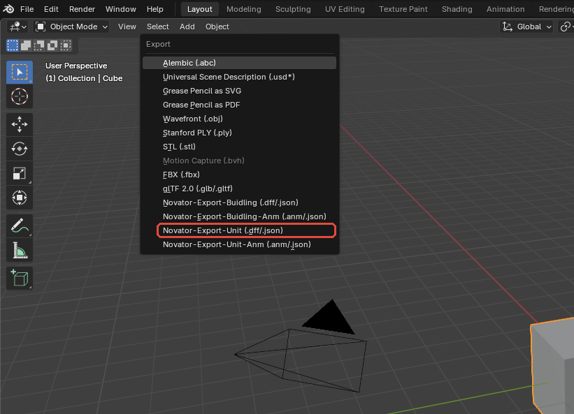

*Figure 22 — The editorial red outline marks **Novator-Export-Unit (.dff/.json)**. The command starts both diagnostic JSON export and binary DFF conversion; the format is selected in the file browser that follows.*

## 14.4 Workflow: complete a future unit DFF round trip after the converter is fixed

**Goal:** Define the acceptance test required before unit DFF export can be called supported for this sample.

**Prerequisites:** Corrected and versioned exporter/converter combination; successful JSON export; non-empty DFF output; clean disposable Blender file.

**Starting state:** Original imported baseline and candidate exported DFF are stored separately; no prior unit objects exist in the re-import scene.

**Menu path:** Export: `File > Export > Novator-Export-Unit (.dff/.json)`; re-import: `File > Import > Novator-Import-Unit (.dff/.json)`

1. Export fresh JSON and record its size/hash and schema.
2. Export a non-empty DFF with no converter exception.
3. Import that DFF into a factory-clean Blender scene.
4. Compare the three-object structure.
5. Compare 41-bone hierarchy, root, bone names, and modifier target.
6. Compare 752 body vertices, 905 triangles, UV data, material assignment, and stored payloads.
7. Compare all 39 groups, per-vertex influences, normalization, and deformation.
8. Compare the selection-sphere marker, parent, location, and X dimension.
9. Only then perform an isolated in-game appearance, deformation, and selection test.

**Expected result:** After a real fix, the clean re-import should reproduce the verified source structure and deformation within documented tolerances. This result has not yet been achieved.

**Verification:** Require both structural comparison and visual deformation checks. A converter exit without an exception is insufficient if counts, weights, hierarchy, material data, or the selection sphere differ.

**Recovery:** If any comparison fails, archive the JSON, DFF, converter version, console output, and difference report. Return status to failed/blocked, correct one layer, and rerun the entire test from the untouched original DFF.

## 14.5 Verified status table

| Operation | Status | Evidence |
|---|---|---|
| Import original `pu_leadersword4.dff` | PASS | 3 objects; 41 bones; body 752 vertices/905 triangles; one marked selection sphere |
| Export unit JSON | PASS | 1,057,469 bytes |
| Export unit DFF | FAIL | Converter rejects unmapped `RpSkin.NumBones` property |
| Re-import exported unit DFF | BLOCKED / NOT RUN | No valid DFF was produced |
| Import matching unit ANM | NOT TESTED | No matching ANM supplied |
| Export or re-import unit animation | NOT TESTED | No compatible Action established |
| Test model or animation in *The Settlers 5* | NOT TESTED | Outside the Blender/converter audit |

## 14.6 Scope of the PASS results

The successful original-DFF import demonstrates that the current importer can construct this sample's armature, body, weights, material assignment, and selection sphere. The successful JSON export demonstrates that the add-on can serialize a non-empty diagnostic unit payload of the stated size.

Neither result proves a working binary export, round-trip equivalence, animation compatibility, texture appearance, game deformation, selection behavior, or gameplay operation. Until the `NumBones` schema mismatch is fixed and the complete workflow in Section 14.4 passes, unit DFF export for this tested revision must remain documented as failed.

# Part IV - Reference

# 15. Complete Menus and Controls Reference

This chapter records the user-facing controls of Novator12 DFF Plugin Blender v5 3.2.1 in Blender 5.0.1. It is a reference, not a substitute for the ordered Building and Unit workflows.

## 15.1 How to read this reference

**Context** describes the Blender state an operator expects: active editor, object, mode, armature, Action, or selected add-on record. Most add-on panels remain visible even when that context is unsuitable. A visible button is therefore not proof that it can run successfully.

**Undo** means that the operator explicitly declares Blender Undo support. If this reference says **No explicit Undo**, do not assume that `Ctrl+Z` will restore the prior state. Save before using the control.

File creation and overwrite are external effects. Blender Undo does not remove or restore exported files. The standard Blender file browser can ask before overwriting, but a multi-file export is not transactional: files written before a later failure remain on disk.

> **Safety baseline:** save a dated `.blend` backup, export JSON first, use a new destination, inspect the console, and re-import binary output in a clean Blender session.

## 15.2 File > Import

The four importers are separate because model type and animation type are not interchangeable. All imports are additive; they do not clear existing objects or add-on records.

| Exact menu label | Accepted input and default | Required context | Result and important effects | Undo / recovery |
|---|---|---|---|---|
| **Novator-Import-Buidling (.dff/.json)** | `.dff` or `.json`; file browser starts with DFF filtering | No existing model is required; use a clean scene | Imports a rigid building, normally creating `Armature_Skin`, mesh objects, Geometry records, Bone/Particle metadata, materials, and sphere helpers. DFF passes through `S5Converter.exe`; JSON bypasses conversion. | No explicit Undo. Close without saving after a wrong or duplicate import. |
| **Novator-Import-Buidling-Anm (.anm/.json)** | `.anm` or animation `.json`; ANM is the normal binary choice | Matching building armature active, or at least one resolvable armature in the scene | Creates a uniquely named Action, makes it active, and can stash the previous Action in a muted NLA strip. Supports hierarchical animation and converter `nodes[]` input; do not expect compressed building input. | No explicit Undo. Reopen the saved model if the wrong armature was used. |
| **Novator-Import-Unit (.dff/.json)** | `.dff` or `.json`; file browser starts with DFF filtering | Clean scene recommended | Imports `Armature_UnitSkin`, a skinned mesh, bone-named vertex groups, Armature modifier, imported skin/material data, and a marked selection sphere. It does not populate the building Geometry Tools list. | No explicit Undo. Close without saving after a wrong or duplicate import. |
| **Novator-Import-Unit-Anm (.anm/.json)** | `.anm` or animation `.json`; ANM is the normal binary choice | Matching unit armature active, or at least one resolvable armature | Creates a new active Action. The unit importer can read compressed animation input in addition to the supported hierarchical path. | No explicit Undo. Reopen the saved unit if the Action was attached to the wrong rig. |
| File-browser **Import** button | Uses the selected path and the importer implied by the menu command | Valid readable file and matching extension | Starts conversion for binary input, then constructs Blender data. No additional model options are exposed in the import browser. | Cancel before execution if the command or file is wrong. |

### Import cautions

- The visible `Buidling` spelling is part of the current add-on UI.
- Keep `.dff` lowercase. A lower-level case-sensitive check can misroute an uppercase `.DFF` file as JSON.
- Repeated imports can accumulate objects, Geometry rows, particles, Actions, and cached imported data.
- The active armature is preferred for animation import; otherwise the importer falls back to a resolvable armature. Select the intended armature explicitly.
- A successful import proves that the add-on constructed Blender data. It does not prove that an unrelated exporter or in-game asset will accept that data.

## 15.3 File > Export

### Model exporters

| Exact menu label or control | Default | Required context | Function and important effects | Undo / recovery |
|---|---|---|---|---|
| **Novator-Export-Buidling (.dff/.json)** | **Format: .dff** | Valid building armature, linked Geometry records, materials, triangulated meshes, valid rigid groups, current BinMesh and spheres | Builds a building payload. JSON is written directly; DFF uses `S5Converter.exe`. Material metadata is synchronized from linked meshes before later export stages and those scene changes can remain even if export fails. | File output is not undoable. Material synchronization can modify the `.blend`; reopen the backup if unwanted. |
| **Novator-Export-Unit (.dff/.json)** | **Format: .dff** | `Armature_UnitSkin`, skinned mesh, valid groups/weights, unit material/triangle data, marked selection sphere as required | Builds a unit payload. JSON is directly inspectable. The revised `pu_leadersword4` JSON export passed; binary DFF failed at the converter's `RpSkin.NumBones` schema boundary. | File output is not undoable. Preserve successful JSON and console error. |
| **Format: .dff / .json** | `.dff` | Model export dialog open | Chooses binary or readable JSON output and rewrites the filename extension. JSON bypasses binary conversion. | Changing the choice is harmless until export; overwritten files are external. |

### Animation exporters

| Exact menu label or control | Default | Required context | Function and important effects | Undo / recovery |
|---|---|---|---|---|
| **Novator-Export-Buidling-Anm (.anm/.json)** | **Format: .anm**; **Actions: Active Action** | Correct building armature and Action | Exports one active Action or a collected batch. Current output payloads are `HierarchicalAnim` regardless of Anim-Type metadata. | External files are not undoable. Batch output is not transactional. |
| **Novator-Export-Unit-Anm (.anm/.json)** | **Format: .anm**; **Actions: Active Action** | Correct unit armature and Action | Uses the same active/batch Action scope and emits hierarchical output. | External files are not undoable. No revised unit ANM sample was available for runtime testing. |
| **Format: .anm / .json** | `.anm` | Animation export dialog open | Chooses converter-backed ANM or direct JSON and rewrites the filename extension. | Re-import ANM; the conversion helper does not reliably reject every nonzero/empty-output failure. |
| **Actions: Active Action / All Actions** | **Active Action** | Resolved armature; at least one exportable Action | Active exports one Action. All Actions collects the active Action plus Actions referenced by NLA strips for that armature. It does not include every detached `bpy.data.actions` entry. | Batch output can be partial; use an empty directory. |
| **Active: `<Action name>`** | Resolved automatically | Active Action mode | Displays the Action data-block name in the dialog. | Confirm that it is the intended Action before writing. |
| `Keine aktive Action gefunden.` | Shown when none resolves | Active Action mode without an Action | Warns in the dialog; execution still fails when no exportable Action exists. | Cancel and activate the correct Action. |
| `Beim Multi-Export wird nur der Zielordner verwendet.` | Informational text | All Actions mode | The chosen filename is ignored; each Action supplies its own output base name. Hidden export names can collide or contain unsuitable path characters. | Review every produced file; earlier files remain after a later failure. |

### Export context and root selection

Model and animation exporters use the active armature when possible and otherwise apply fallback selection. Isolate and select the intended rig rather than relying on scene order.

For animation export, a filename suffix `_500` through `_599`, or `_600` or higher, can force root-node selection. A syntactically valid but semantically wrong suffix can export the wrong subtree. Without a qualifying suffix, the exporter uses hierarchy-specific fallback logic.

The standard file browser provides normal overwrite confirmation for a single target. It cannot make All Actions export transactional and cannot sanitize duplicate hidden Action output names.

## 15.4 Bone Tools > Bone Manager

The **Bone Tools** sidebar tab contains the **Bone Manager** panel. It edits building UserData/effect mappings; it does not create, rename, move, or delete Blender bones.

| Control | Default | Context | Function | Undo / destructive behavior |
|---|---|---|---|---|
| **Idx** | New row: `999` | Building metadata row selected | Free-form frame/Atomic index string used for the mapping. Invalid and duplicate text is not immediately rejected. | Editing has no explicit Undo declaration. |
| **Num** | New row: `999` | Building metadata row selected | Free-form HAnim node-ID string. | Editing has no explicit Undo declaration. |
| **Mat** | New row: `Decal` | Building metadata row selected | Selects `Decal` or `Building`. `Decal` produces `BuildingDecalWithSnow` with flat decal behavior; `Building` produces `SimpleObjectWithSnow`. | No explicit Undo. |
| **Tag** | Off | Building metadata row selected | Includes or preserves `tag = <Bone Name>` with the effect. | No explicit Undo. |
| **Add Bone** | Adds `999 / 999 / Decal / Tag off` | Panel visible | Appends one metadata mapping. It does not add a Blender bone. | No explicit Undo; no confirmation. |
| **Remove Bone** | — | A row selected | Removes only the selected mapping. | No explicit Undo; no confirmation. |
| **Reset** | — | Panel visible | Removes all Bone Manager mappings. | No explicit Undo; no confirmation. Save first. |

Use one deliberate mapping for each intended frame/node pair. Duplicate and conflicting mappings are not validated consistently.

## 15.5 Sphere Tools > Sphere Menu

These controls create and validate **building** Geometry bounds. They do not create the specially marked unit selection sphere.

| Control | Default / calculated value | Required context | Function | Undo / destructive behavior |
|---|---|---|---|---|
| **Generate** | Opens a dialog populated from the mesh | Active building mesh; at least one vertex group; first usable group resolves to a bone in a building armature | Calculates a proposed bound and replaces the mesh's sphere proxy with a hidden, non-rendering wire child named from the mesh. Stores export-facing properties. | No explicit Undo and no confirmation. Proxy cleanup can delete child meshes whose data names match sphere-proxy rules. |
| **X, Y, Z** | Local AABB midpoint calculated when invoked | Generate dialog | Proposed sphere center in the add-on's display/local representation. | Confirming replaces the prior proxy. |
| **Radius** | Greatest export-space distance from proposed center to a mesh vertex; minimum `0.01` | Generate dialog | Sets the proposed sphere radius. | Confirming replaces the prior proxy. |
| **Validate** | — | Enabled only when Geometry records exist | Runs **Validate All Spheres**, rebuilding every unique linked Geometry mesh sphere and logging skipped failures. | Explicit Undo support. Existing proxies are replaced. |

The exported value is a coarse RenderWare bound. The implementation does not prove precise in-game collision behavior. Manually moving a proxy is not a reliable substitute for regenerating stored center/radius data.

Only a unit object marked `s5_sphere_type="SelectionSphere"` is recognized as the unit selection sphere. **Generate** does not add that marker.

## 15.6 Particle Tools

Particle rows describe building particle payloads. They do not create a Blender particle simulation.

| Control | Default | Context | Function | Undo / destructive behavior |
|---|---|---|---|---|
| **Index** | New row: `999` | Particle row selected | Free-form frame/Atomic index. It should match the **Bone Index** of the corresponding Empty Geometry record. | No explicit Undo. |
| **Type** | New row: `smoke10` | Particle row selected | Selects an imported `Ubisoft` payload or a built-in named effect. | No explicit Undo. |
| **Add Effect** | `999 / smoke10` | Panel visible | Appends a particle record. | No explicit Undo; no confirmation. |
| **Remove Effect** | — | A row selected | Removes the selected particle record. | No explicit Undo; no confirmation. |
| **Reset** | — | Panel visible | Clears all particle rows. | No explicit Undo; no confirmation. Imported module-level payload cache remains. |

The current type list is `Ubisoft`, `PB_Weathermachine_lightning`, `TMP_resourceGold_Sparkle`, `XD_StoneSparkles`, `XF_Leaves`, `fire01`, `fire02`, `firewheel`, `salimTrapIcon`, `smoke10`, `smoke11`, `smoke12`, `sulfur_spray`, and `woodchip`.

`Ubisoft` preserves imported payload data held by the add-on. That cache can survive **Clear Scene**, so use a new Blender process for unrelated particle tests.

## 15.7 Geometry Tools > Geometry Tools

Geometry records are building export records. Unit import does not populate this list.

### Geometry list and relationship fields

| Control | Default / context | Function | Undo / destructive behavior |
|---|---|---|---|
| Geometry list row | Existing imported/configured records | Selects a record and attempts to activate and unhide its linked mesh. Status icons distinguish linked, empty, mismatched, missing, and valid states. | Selection only. |
| **+** beside Geometry list | Active mesh, or no usable mesh | With an active mesh, links a new Geometry record and synchronizes its materials. Otherwise creates an Empty Geometry record. | No explicit Undo. |
| **X** beside Geometry list | Selected row | Removes only the metadata row; it does not delete the mesh. | No explicit Undo; no confirmation. |
| **Reset** beside Geometry list | All rows | Clears all Geometry records without deleting the Blender meshes. | No explicit Undo; no confirmation. |
| **Scene Object** | Existing pointer or empty | Links a Mesh Object. Updating it refreshes the derived relationship state. | No explicit Undo. |
| **Mesh Name** | Derived for a normal link | Export-facing mesh name. Normally disabled when linked; editable for empty or unlinked records. | No explicit Undo. |
| **Bone Index** | Derived for a normal link | Frame/bone index. Normally disabled for a linked mesh; editable and important for particle-only Empty Geometry. | No explicit Undo. |
| **BinMesh Data** | Imported/generated JSON, `No data`, or `Empty-Geometry` | Displays and permits raw editing of stored BinMesh text/status. Direct editing is error-prone and does not replace validation. | Text edits have no dedicated safety check. |

### Material records

| Control | Default | Function | Undo / important behavior |
|---|---|---|---|
| **Sync from Mesh** | Uses current linked mesh slots | Copies material slot count and names into Geometry metadata while preserving compatible fields. Building export also performs this synchronization automatically. | Explicit Undo. Automatic export sync can remain after a later failure. |
| Material **+** | New empty/initial record | Adds one material metadata row. | No explicit Undo. |
| Material **X** | — | Removes the final material metadata row. | No explicit Undo; no confirmation. |
| **Material Name** | Synchronized slot name | Export material name. Preserve order with Blender material slots. | No explicit Undo. |
| **UVTrans** | Off | Enables the UV-transform effect branch. | If UVTrans and DualTex are both on, UVTrans takes precedence. |
| **DualTex** | Off | Enables the dual-texture effect branch. | Does not combine with UVTrans in the current `if/elif` path. |
| **Ambient** | On | Ambient material flag. | No explicit Undo. |
| **Specular** | Off | Specular material flag. | No explicit Undo. |
| **Diffuse** | On | Diffuse material flag. | No explicit Undo. |
| **Snow Texture** | `No data` | Snow-texture metadata string. | Compatible Sync from Mesh preserves it. |
| **Texture Alpha** | Empty | Optional alpha-related texture metadata string. | No explicit Undo. |

Material slot order and face material indices feed BinMesh grouping. After adding, removing, renaming, or reordering material slots, synchronize and regenerate or validate BinMesh.

## 15.8 Geometry Tools > Mesh Validation

| Control | Required context | Checks / function | Undo / side effects |
|---|---|---|---|
| **Validate Selected Mesh** | Active Mesh Object; Edit Mode is accepted but changed to Object Mode | Reports non-triangular faces, repeated vertex indices within a polygon, loose vertices, UV loop-count mismatch, missing UVs on used vertices, and multiple UV coordinates per vertex. A missing UV layer is reported as a warning rather than created. | No explicit Undo. Stores a visible report and can change Edit Mode to Object Mode. |
| **Delete Loose Vertices** | Appears after the current report finds loose vertices; active mesh must still be the intended mesh | Deletes the reported loose vertices and refreshes the report. | No explicit Undo; no confirmation; topology and indices can change. |

Stored validation-report text is not cleared by **Clear Scene**. Always verify the active mesh name and rerun validation rather than trusting an old report.

## 15.9 Geometry Tools > UV Validation

Single-mesh operations use the active mesh or the mesh linked by the selected Geometry row. Bulk operations use linked Geometry records only; imported units without Geometry rows are not automatically included.

| Control | Scope | Function | Undo / important side effects |
|---|---|---|---|
| **Validate** | One mesh | Checks loose geometry, edges used by more than two faces, winding, zero/non-finite normals, missing or more than two UV layers, loop-count mismatch, non-finite UVs, multiple UVs per vertex, and discontinuities without seams. | No explicit Undo; reports only. |
| **Fix UV** | One mesh | Attempts to sanitize non-finite UV values, mark seams, split conflicting vertices, remove loose vertices, and recalculate normals. Copies shared mesh data before modification. | Explicit Undo. Can change topology and indices. |
| **Validate All** | All linked Geometry meshes | Runs the validator on the building Geometry set. | No explicit Undo. Units without Geometry records are omitted. |
| **Fix All** | All linked Geometry meshes | Attempts the same repairs across linked building meshes. | Explicit Undo. Can change many meshes and dependent indices. |

The fixer can refuse shape keys, more than 65,535 loops, missing UV data, or structural inconsistencies. It does not triangulate faces and does not repair general non-manifold topology. After a successful fix, rerun Mesh Validation, regenerate or validate BinMesh, and rebuild building spheres.

## 15.10 Geometry Tools > BinMesh Validation

BinMesh stores indexed triangle/material grouping. The supported record uses `Flags.UnIndexed=false` with `Type=TriStrip`; despite the type name, the validator compares the stored indexed triangle/material membership with the current triangulated mesh.

| Control | Required context | Function | Undo / destructive behavior |
|---|---|---|---|
| **Validate** | Active mesh and selected matching Geometry record | Checks schema, `UnIndexed=false`, `TriStrip`, index/material ranges, triangulation, and exact material/triangle multiset agreement. An unrelated active mesh can cause an error instead of falling back to the selected row. | No explicit Undo. |
| **Generate** | Active Geometry mesh with vertices/faces, full triangulation, materials, first vertex group, matching armature/bone metadata, and converter | Generates stored BinMesh data for the active mesh. Empty Geometry is not generated. | Explicit Undo. Replaces stored data. |
| **Delete BinMesh** | Selected Geometry row | Deletes that record's stored BinMesh data. | Explicit Undo; no confirmation. |
| **Generate All Invalid BinMeshes** | Linked Geometry records | Validates all linked records and regenerates invalid ones; skips Empty Geometry appropriately. | Explicit Undo. Can update many records. |
| **Delete All BinMeshes** | Geometry records exist | Deletes all stored BinMesh records. | Explicit Undo and a confirmation dialog. |

Directly edited invalid BinMesh JSON is not safer than generated data. Always validate after topology or material-index changes.

## 15.11 Scene Tools

| Control | Scope | Function | Undo / destructive behavior |
|---|---|---|---|
| **Clear Scene** | Entire Blender file, not only selection or active scene | Forces Object Mode; unhides/unlocks objects; deletes every object data-block, including objects linked to other scenes; removes child collections; removes the active scene World when unused; deletes every Action; clears Bone/Particle/Geometry records; resets animation UI tracking; and performs repeated orphan-purge passes. | No confirmation and no explicit Undo. Validation-report strings and module-level imported material/particle caches can survive. Close without saving and reopen a known-good file for recovery. |

Use **Clear Scene** only in an expendable file. Ordinary Blender selection deletion or opening a new file is safer for normal workflow cleanup.

## 15.12 Dope Sheet > Animation Tool

The **Animation Tool** tab is registered in the Dope Sheet sidebar. In Blender 5.0.1, opening it with an Action can trigger a confirmed draw error because the panel attempts to write an Action ID property during `draw()`.

| Control | Default | Intended function | Current Blender 5.0.1 status / Undo |
|---|---|---|---|
| **Animation** | Resolved Action name | Read-only display of the Action used by the panel. | Draws before the confirmed error in the captured state. |
| **FPS** | String `30` | Target FPS used by Apply FPS. | Intended control can fail to draw after the ID-write exception. |
| **Anim-Type** | `HierarchicalAnim` | Metadata enum: `HierarchicalAnim`, `CompressedAnim`, or `Nodes`. | Can fail to draw. Exporters currently emit hierarchical output regardless of this value. |
| **Start-Prev-Keyframe** | String `-123456789` | Stores/parses prior-keyframe metadata. | Can fail to draw; current exporter behavior does not make this a general output-format selector. |
| **Apply FPS** | Uses FPS field | Validates numeric values, multiplies keyframe positions and handles by target/current FPS, sets scene FPS with `fps_base=1`, sets timeline start to 0, end to rounded duration, and current frame to 0. It does not shift the Action's first key to frame zero. | Can fail to draw; no explicit Undo. Save before retiming. |
| **Export-Name** | Hidden property | Supplies an output base name for Action export. | Registered and used by export code but not drawn in this panel. |
| `UI-Fehler im Animation Tool.` | Error fallback | Reports the panel draw failure. | Confirmed in Blender 5.0.1 when drawing attempts to write `Action.s5_anim_format`. |

Use the standard Action Editor, Timeline, File import/export menus, console output, and clean re-import while the panel defect remains. A developer may invoke underlying operators by script, but that is outside the supported user-facing workflow.

## 15.13 Undo and confirmation summary

The following add-on operations explicitly declare Undo:

- **Validate All Spheres**;
- **Sync from Mesh**;
- **Fix UV** and **Fix All**;
- **Generate BinMesh**;
- **Delete BinMesh**;
- **Generate All Invalid BinMeshes**; and
- **Delete All BinMeshes**.

Only **Delete All BinMeshes** also presents an add-on confirmation dialog.

Do not assume Undo for imports, exports, sphere generation, Bone/Particle/Geometry row changes, material-row changes, Mesh Validation cleanup, Apply FPS, or Clear Scene. The standard file browser can separately confirm a normal file overwrite.

---

# 16. Troubleshooting and Known Limitations

Start from a saved copy, reproduce one issue at a time, export JSON where possible, and retain the complete Blender console message.

## 16.1 Buildings: troubleshooting

| Symptom | Likely cause / diagnosis | Corrective action |
|---|---|---|
| Duplicate meshes, Geometry rows, or particles after import | Building import is additive and an existing scene was reused | Close without saving and import once into a clean file. Do not use Clear Scene in a valuable file. |
| Building mesh is skipped or follows the wrong bone | First usable vertex group is absent, ordered incorrectly, or does not match a bone; Armature modifier targets the wrong rig | Restore a valid bone-named rigid group as the first usable group, target `Armature_Skin`, and verify the Geometry relationship. |
| Material reports mismatch or **Sync required** | Blender material slots and Geometry metadata differ | Assign real materials, preserve slot order, press **Sync from Mesh**, then recheck UVTrans, DualTex, snow, alpha, and lighting flags. |
| Texture, alpha, snow, or decal effect is wrong | Material name/slot, `Texture Alpha`, DualTex, snow metadata, or Bone Manager mapping is wrong | Inspect the exported JSON and the exact material/effect record. Do not judge only by the Blender shader preview. |
| Both UVTrans and DualTex are enabled | Current exporter uses an `if/elif` branch and gives UVTrans precedence | Enable only the intended branch, export JSON, and confirm the payload. |
| Non-triangular, loose, degenerate, or flipped geometry | Mesh topology, winding, or normals are invalid | Work on a copy; triangulate deliberately; repair the reported faces; recalculate normals appropriately; rerun Mesh and UV validation. |
| UV fixer refuses the mesh | Shape keys, more than 65,535 loops, missing UV data, or structural inconsistency | Repair manually or simplify a copy. The fixer does not triangulate or repair general non-manifold topology. |
| Invalid BinMesh | Stored indexed triangle/material grouping no longer matches current mesh or materials | Confirm `UnIndexed=false`, `TriStrip`, triangulation, valid indices, materials, first group, and rig; then Generate and Validate again. |
| BinMesh command affects/fails on the wrong object | An unrelated mesh is active while another Geometry row is selected | Activate the exact linked Geometry mesh before the single-entry operation. |
| Building sphere is too small, misplaced, or stale | Mesh/transform changed after calculation, or visible proxy was moved manually | Use **Generate** or **Validate All Spheres**. Compare stored center/radius and linked mesh; do not rely on manual proxy movement. |
| Particle is missing | Particle Index and Empty Geometry Bone Index do not match, or `Ubisoft` cache is unavailable | Pair the same numeric index with a particle-only Empty Geometry record. Use a fresh process for unrelated imported payloads. |
| Uppercase `.DFF` fails as JSON | Lower-level loader checks lowercase `.dff` case-sensitively | Rename a copy to lowercase `.dff` and retry. |
| Exported building differs from modifiers in the viewport | Export reads source mesh/rig data rather than a general evaluated modifier stack | Bake the intended result only on a backup; preserve armature relationships; then rerun every validator and round trip. |

### Confirmed building limitations

- Building material synchronization occurs before later export stages and can mutate scene metadata even if export subsequently fails.
- Sphere helpers prove stored export bounds, not exact in-game collision semantics.
- Particle `Ubisoft` data depends on imported session cache; Clear Scene does not reliably reset it.
- Most building panels remain visible in invalid contexts. **Validate All Spheres** is the main availability-gated exception.
- BinMesh and the bulk Geometry validators are building-oriented and depend on Geometry records.
- A wrong but valid animation filename suffix can force the wrong root.
- The revised PB_Factory round trip is evidence for one configured scene, not universal compatibility.

## 16.2 Units: troubleshooting

| Symptom | Likely cause / diagnosis | Corrective action |
|---|---|---|
| Unit is absent from Geometry batch validation | Unit import does not create building Geometry Tools records | Use the active-mesh checks that are applicable; do not assume building bulk tools cover units. |
| Unit DFF export fails on `NumBones` | Bundled converter cannot map generated `RpSkin.NumBones` | Preserve the successful JSON and exact exception. Do not fabricate or rename a file as DFF. Correct exporter/converter schema compatibility, then rerun binary export and re-import. |
| Unit deforms incorrectly | Unknown/missing bone groups, unnormalized weights, more than four significant influences, or wrong Armature modifier | Use valid bone-named groups, remove meaningless influences, normalize, limit to four, and playback-test the full pose range. |
| Some vertices remain behind or collapse | Vertex has no valid positive bone influence | Inspect every vertex weight sum and assign at least one valid influence. The add-on does not provide a complete unweighted-vertex validator. |
| Topology edits disappear or corrupt output | Imported `s5_triangles` can take precedence over current Blender polygons | Treat topology changes as developer-level until stored triangle metadata is deliberately regenerated and independently verified. Export JSON before and after. |
| Blender material edits do not reach output | Imported raw unit material payload can take precedence over fallback Blender material construction | Inspect exported JSON. Do not assume building **Sync from Mesh** behavior applies to units. |
| Unit selection sphere is missing from export | Imported marker was deleted, or a building Sphere Tools proxy was substituted | Preserve the object marked `s5_sphere_type="SelectionSphere"`; verify its parent, location, and X dimension. Do not replace it with Generate Sphere. |

### Confirmed unit limitations

- Revised `pu_leadersword4` binary DFF export is blocked by the confirmed `RpSkin.NumBones` converter-schema error; no DFF was produced and no DFF re-import could run.
- Unit export keeps at most four strongest positive influences that map to valid bones and renormalizes them. Unknown groups are ignored; unweighted vertices can reach the payload as zero influences.
- Imported triangle and raw material payloads can become stale after ordinary Blender topology or material edits.
- Building Geometry, BinMesh, bulk UV, and sphere tools do not automatically target units.
- A building sphere proxy is not a unit SelectionSphere.
- No unit animation sample was available for the revised runtime audit, so no revised unit ANM result is claimed.

## 16.3 Animations: troubleshooting

| Symptom | Likely cause / diagnosis | Corrective action |
|---|---|---|
| Animation Tool shows `UI-Fehler im Animation Tool.` | Panel draw attempts to write an Action ID property in Blender 5.0.1 | Use the File menu, Action Editor, Timeline, and console. Fix the panel implementation before relying on its metadata/timing controls. |
| Animation plays at the wrong speed | Scene FPS, Action timing intent, and key positions disagree | Record source FPS; retime only on a backup; verify real duration, frame range, first/last poses, and re-imported output. |
| Apply FPS changed key positions unexpectedly | It rescales keyframes and handles by a ratio; it is not only a playback-rate switch | Reopen the saved backup. The operator has no explicit Undo declaration. |
| Export uses the wrong root | Numeric filename suffix forces another subtree, or fallback resolved an unintended armature/root | Remove an accidental suffix or use the intended `_500`–`_599`/`>=600` value; explicitly select the rig; re-import and compare root motion. |
| **All Actions** omits an Action | Detached Action is neither active nor referenced by an NLA strip | Make it active or reference it in an NLA strip, then export to an empty directory and inspect output names. |
| Batch export overwrites or stops partway | Hidden export names collide/contain unsuitable characters; operation is not transactional | Export Actions individually or resolve names; inspect and retain partial files until the failure is understood. |
| ANM appears successful but is empty or invalid | Converter helper does not reliably reject every nonzero return or empty stdout | Check existence and size, inspect console/JSON, and re-import ANM onto a clean matching rig. |
| Scale animation is missing | Current exporter builds translation and quaternion-rotation tracks | Do not depend on bone-scale curves surviving export. Verify the actual re-imported channels. |
| Compressed animation expectation fails | Unit import can read compressed input; building import does not; exporters emit hierarchical output | Use the format path supported by the matching importer and verify exported JSON type. Treat Anim-Type as metadata, not a codec switch. |

### Confirmed animation limitations

- The populated Animation Tool panel has a confirmed Blender 5.0.1 draw defect.
- **Anim-Type** does not switch exporter encoding; current exporters construct `HierarchicalAnim`.
- **Export-Name** is used for output naming but is not exposed in the panel.
- **All Actions** is limited to the resolved armature's active and NLA-referenced Actions.
- ANM conversion requires clean re-import because the helper has an output-check gap.
- Translation and quaternion rotation are exported; scale-key preservation is not guaranteed.
- Revised PB_Factory building ANM export and clean re-import passed. No revised unit ANM sample existed, and no in-game animation test was performed.

## 16.4 Shared setup and safety problems

| Symptom | Diagnosis | Corrective action |
|---|---|---|
| Add-on cannot be enabled | Incomplete archive, wrong nesting, missing modules, or unsupported environment | Install the complete package in Blender 5.0.1 and inspect the system console. |
| File menu entries are missing | Add-on disabled or registration failed | Enable it in **Edit > Preferences > Add-ons**, restart Blender, and verify File > Import/Export. |
| Sidebar panels are missing | Sidebar closed or wrong editor | Press `N` in the 3D Viewport for Bone/Sphere/Particle/Geometry/Scene Tools; use the Dope Sheet for Animation Tool. |
| A visible button fails | Active editor, object, mode, armature, Action, or record is unsuitable | Re-establish the documented context. Visibility alone is not availability. |
| Converter is missing | `S5Converter.exe` is not beside the add-on code | Restore it from the complete trusted package. There is no converter-path preference. |
| JSON succeeds but DFF/ANM fails | Converter schema/input differs from the payload or conversion failed | Preserve JSON and stderr, diagnose the exact property/type, correct compatibility, and retest. |
| Clear Scene removed unrelated work | It is a file-wide destructive reset with no confirmation | Close without saving and reopen the backup. Do not use it in production or multi-scene files. |

### General limitations

- Blender 5.0.1 and add-on 3.2.1 are the documented baseline; other versions require independent testing.
- Binary conversion depends on the bundled community S5Converter executable.
- Imports are additive.
- Many metadata changes have no explicit Undo declaration.
- Successful Blender operators and non-empty files do not prove byte identity or in-game correctness.
- No in-game test was performed for the revised evidence set.

---

# 17. Glossary

| Term | Meaning in this handbook |
|---|---|
| **AABB** | Axis-aligned bounding box: the minimum/maximum box aligned to X, Y, and Z used by the sphere calculation to obtain a center. |
| **Action** | Blender animation data-block containing F-curves and keyframes for an armature or object. |
| **ANM** | Binary animation file used by this toolchain; converter-backed counterpart to animation JSON. |
| **Armature** | Blender skeleton object/data containing bones. Buildings normally use `Armature_Skin`; units normally use `Armature_UnitSkin`. |
| **Armature modifier** | Blender modifier that deforms or relates a mesh through an armature and matching vertex groups. |
| **Atomic** | RenderWare renderable association between Geometry and a Frame. |
| **BinMesh** | RenderWare extension grouping indexed triangles by material. This add-on expects `UnIndexed=false` and `Type=TriStrip` for the supported building record. |
| **Bone** | One element of a Blender armature hierarchy, with a rest transform and pose transform. It can represent a RenderWare frame/node. |
| **Bone Manager** | Building metadata panel inside the Bone Tools tab; it stores frame/node effect mappings and does not edit Blender bones. |
| **Bound** | Simplified region enclosing geometry for coarse spatial tests. It is not automatically a precise collision shape. |
| **Bounding sphere** | Center plus radius enclosing geometry; building Sphere Tools store this export-facing bound. |
| **Clump** | RenderWare model-level grouping of frames and atomics. |
| **Collection** | Blender organizational container linking objects. |
| **CompressedAnim** | Compressed animation input form accepted by the unit importer; current exporters do not emit it. |
| **Converter** | `S5Converter.exe`, the bundled community program translating binary DFF/ANM and JSON. |
| **Data-block** | Reusable Blender data such as Mesh, Armature, Material, or Action data. |
| **DFF** | Binary RenderWare model container used by the model workflow. |
| **DualTex** | Building material metadata selecting the dual-texture export branch when UVTrans is not also taking precedence. |
| **Edge** | Mesh connection between two vertices. |
| **Empty Geometry** | Geometry metadata record with no render mesh/BinMesh, used for relationships such as particle-only frames. |
| **Export space** | Coordinate space in which the add-on writes final values after its transformations/conversions. |
| **Face / polygon** | Mesh surface bounded by edges. A triangle is a three-corner face. |
| **F-curve** | Blender curve storing an animated property over time. |
| **Frame** | RenderWare transform node; represented by the imported armature/bone hierarchy. |
| **Geometry** | RenderWare mesh-like data: vertices, triangles, normals, UVs, materials, bounds, and extensions. Also the name of the building tool record. |
| **HAnim** | RenderWare hierarchy/node information used for skeletal and animation relationships. |
| **HierarchicalAnim** | Hierarchical animation form emitted by the current building and unit exporters. |
| **JSON** | Readable interchange representation handled directly by the add-on and used as input/output for binary conversion. |
| **Keyframe** | Stored value of an animated property at a frame/time. |
| **Loop** | Blender face-corner record; UV coordinates and some normals are stored per loop. |
| **Material** | Surface/texture definition. Mesh faces refer to ordered material slots by index. |
| **Mesh** | Blender surface data composed of vertices, edges, faces, and loops. |
| **Modifier** | Non-destructive Blender operation evaluated for display; this exporter does not promise arbitrary modifier-stack output. |
| **NLA** | Blender Nonlinear Animation system. NLA strips can reference Actions and affect All Actions export collection. |
| **Normal** | Direction perpendicular to a face or corner, used for sidedness and lighting. |
| **Object** | Blender scene element with transforms, parenting, visibility, modifiers, and a link to object data. |
| **Origin** | Object transform reference point. |
| **Particle record** | Add-on building metadata linking a frame/Atomic index to a named or imported particle payload. |
| **Pose Mode** | Blender mode for posing and animating armature bones without redefining the rest hierarchy. |
| **Proxy sphere** | Hidden wireframe Blender helper representing stored building-bound data. |
| **Quaternion** | Four-component rotation representation used by the animation export path. |
| **Rest pose** | Armature's underlying bone structure edited in Armature Edit Mode. |
| **Rigid assignment** | Building relationship in which an entire mesh part follows one controlling frame/bone. |
| **Seam** | Marked mesh edge where a UV surface can split into separate islands. |
| **SelectionSphere** | Specially marked unit sphere read from its location and X dimension; not interchangeable with a building proxy sphere. |
| **SkinPLG** | RenderWare skin extension containing per-vertex bone indices/weights and related data. |
| **Topology** | Connectivity and ordering of mesh vertices, edges, and faces. |
| **Transform** | Location, rotation, and scale of an object or bone. |
| **Triangle** | Three-corner face and the basic face representation expected by the building BinMesh workflow. |
| **TriStrip** | BinMesh type used by the supported indexed grouping record. |
| **UnIndexed** | BinMesh flag; the validated supported state is `false`, meaning indexed data. |
| **UserData** | RenderWare extension used here for building/decal effect metadata and optional tags. |
| **UV coordinates** | Two-dimensional coordinates mapping face corners to a texture. |
| **UVTrans** | Building material metadata selecting the UV-transform export branch; it takes precedence over DualTex in the current logic. |
| **Vertex** | Indexed 3D point in a mesh. |
| **Vertex group** | Named collection of vertices and weights, commonly aligned with an armature bone. |
| **Weight** | Influence strength from 0 to 1 connecting a vertex to a bone/group. Unit export retains at most four valid positive influences and normalizes them. |
| **Winding** | Ordered traversal of a face's vertices, which determines the face-normal direction. |

---

# 18. References and Test Evidence

## 18.1 Official Blender 5.0 documentation

- [Blender 5.0 Manual](https://docs.blender.org/manual/en/5.0/)
- [Installing and managing add-ons](https://docs.blender.org/manual/en/5.0/editors/preferences/addons.html)
- [Data-blocks](https://docs.blender.org/manual/en/5.0/files/data_blocks.html)
- [Outliner introduction](https://docs.blender.org/manual/en/5.0/editors/outliner/introduction.html)
- [Collections](https://docs.blender.org/manual/en/5.0/scene_layout/collections/collections.html)
- [Interaction modes](https://docs.blender.org/manual/en/5.0/editors/3dview/modes.html)
- [Meshes: Introduction](https://docs.blender.org/manual/en/5.0/modeling/meshes/introduction.html)
- [Mesh structure](https://docs.blender.org/manual/en/5.0/modeling/meshes/structure.html)
- [Editing normals](https://docs.blender.org/manual/en/5.0/modeling/meshes/editing/mesh/normals.html)
- [Mesh cleanup](https://docs.blender.org/manual/en/5.0/modeling/meshes/editing/mesh/cleanup.html)
- [UV unwrapping introduction](https://docs.blender.org/manual/en/5.0/modeling/meshes/uv/unwrapping/introduction.html)
- [UV layout workflow](https://docs.blender.org/manual/en/5.0/modeling/meshes/uv/workflows/layout.html)
- [Materials introduction](https://docs.blender.org/manual/en/5.0/render/materials/introduction.html)
- [Material assignment](https://docs.blender.org/manual/en/5.0/render/materials/assignment.html)
- [Image Texture node](https://docs.blender.org/manual/en/5.0/render/shader_nodes/textures/image.html)
- [Object transforms](https://docs.blender.org/manual/en/5.0/scene_layout/object/properties/transforms.html)
- [Apply transforms](https://docs.blender.org/manual/en/5.0/scene_layout/object/editing/apply.html)
- [Parenting objects](https://docs.blender.org/manual/en/5.0/scene_layout/object/editing/parent.html)
- [Armatures introduction](https://docs.blender.org/manual/en/5.0/animation/armatures/introduction.html)
- [Armature structure](https://docs.blender.org/manual/en/5.0/animation/armatures/structure.html)
- [Bone structure](https://docs.blender.org/manual/en/5.0/animation/armatures/bones/structure.html)
- [Posing introduction](https://docs.blender.org/manual/en/5.0/animation/armatures/posing/introduction.html)
- [Skinning introduction](https://docs.blender.org/manual/en/5.0/animation/armatures/skinning/introduction.html)
- [Armature modifier](https://docs.blender.org/manual/en/5.0/modeling/modifiers/deform/armature.html)
- [Vertex groups](https://docs.blender.org/manual/en/5.0/modeling/meshes/properties/vertex_groups/introduction.html)
- [Vertex weights](https://docs.blender.org/manual/en/5.0/modeling/meshes/properties/vertex_groups/vertex_weights.html)
- [Weight Paint introduction](https://docs.blender.org/manual/en/5.0/sculpt_paint/weight_paint/introduction.html)
- [Keyframes](https://docs.blender.org/manual/en/5.0/animation/keyframes/introduction.html)
- [Action Editor](https://docs.blender.org/manual/en/5.0/editors/dope_sheet/modes/action.html)
- [Timeline](https://docs.blender.org/manual/en/5.0/editors/timeline.html)
- [Viewport bounds display](https://docs.blender.org/manual/en/5.0/scene_layout/object/properties/display.html)
- [Blender 5.0 Mesh API](https://docs.blender.org/api/5.0/bpy.types.Mesh.html)
- [Blender 5.0 Object API](https://docs.blender.org/api/5.0/bpy.types.Object.html)

## 18.2 RenderWare and converter references

- Electronic Arts, [RenderWare 3 documentation repository](https://github.com/electronicarts/RenderWare3Docs).
- Electronic Arts, [RenderWare Graphics 3.5 User Guide, Volume I](https://github.com/electronicarts/RenderWare3Docs/blob/master/userguide/UserGuideVol1.pdf), June 10, 2003. Relevant general topics include frames, clumps, atomics, geometries, materials, morph targets, bounds, and skinned models.
- Electronic Arts, [RenderWare Graphics 3.5 User Guide, Volume II](https://github.com/electronicarts/RenderWare3Docs/blob/master/userguide/UserGuideVol2.pdf), June 10, 2003. Relevant general topics include Skinning, HAnim, UV Animation, Morph, material effects, and particle systems.
- Electronic Arts, [RenderWare Graphics 3.5 User Guide, Volume III](https://github.com/electronicarts/RenderWare3Docs/blob/master/userguide/UserGuideVol3.pdf), June 10, 2003. Relevant general topic: User Data.
- mcb5637, [S5Converter repository](https://github.com/mcb5637/S5Converter). S5Converter is a community project, not official Ubisoft documentation.

## 18.3 Local implementation and evidence sources

- Add-on registration and File menu operators: `BlenderPlugin/Novator12_DFF_Plugin_Blender_v5/__init__.py` and `Comfort/ui_registration.py`.
- Building tools and cleanup: `Comfort/ui_tools.py` and the building import/export modules.
- Animation UI and timing behavior: `Comfort/ui_animation.py` and `Comfort/anim_utils.py`.
- UV and BinMesh behavior: `Comfort/uv_tools.py`, `Comfort/bin_mesh_tools.py`, and `Comfort/bin_mesh_utils.py`.
- Unit import/export behavior: `unit_model_import.py`, `unit_model_export.py`, `unit_anm_import.py`, and `unit_anm_export.py`.
- User-facing requirement trace: [Coverage matrix](Settlers_5_Blender_Plugin_Coverage_Matrix_EN.md).
- Revised runtime results and exact exception: [Test report](Settlers_5_Blender_Plugin_Test_Report_EN.md).
- Automated audit helpers: `_tools/revision_asset_roundtrip.py` and `_tools/revision_building_animation_audit.py`.

These paths identify inspectable project evidence without asserting a source-control revision.

## 18.4 Revised PB_Factory building evidence

The configured source scene was `docs/handbook/_test/PB_Factory.blend`. It was inspected in Blender 5.0.1 with add-on 3.2.1.

### Source inventory

| Area | Verified state |
|---|---:|
| Blender objects | 73 |
| Armature objects | 1 (`Armature_Skin`) |
| Mesh objects | 72 |
| Geometry-record meshes | 36 |
| Sphere/helper meshes | 36 |
| Geometry vertices | 9,200 |
| Geometry edges | 13,067 |
| Geometry faces | 5,660, all triangles |
| Armature bones | 82; root `frame_000` |
| Assigned materials | 8 |
| Geometry Tools records | 36 |
| Bone Manager records | 3 |
| Particle Tools records | 2 |
| Actions | 1 (`Armature_SkinAction`) |

The Action had range `0–144`, scene playback rate 24 FPS, 30 F-curves, 150 keyframe points at `0`, `24`, `64`, `104`, and `144`, and three animated bones. The source contained scale curves, but current export guarantees only translation and quaternion rotation.

### Model export and clean re-import

| Step | Result |
|---|---|
| Building JSON export | **PASS**; 8,673,678 bytes |
| Building DFF export | **PASS**; 468,825 bytes |
| Clean DFF re-import | **PASS** |
| Re-imported principal counts | 73 objects, 82 bones, 36 Geometry records, 9,200 Geometry vertices, 5,660 Geometry faces, and 36 spheres |

The count agreement is a structural integration result. It is not a claim of byte-for-byte binary identity.

### Building animation export and clean re-import

| Step | Result |
|---|---|
| Building animation JSON export | **PASS**; 2,652,031 bytes |
| Building ANM export | **PASS**; 167,612 bytes |
| ANM re-import onto a clean matching rig | **PASS** |
| Re-imported Action range | `0–144` |

Automatic root resolution selected node ID `603` for this PB_Factory hierarchy. That result is asset-specific and is not a universal building root.

## 18.5 Revised pu_leadersword4 unit evidence

The revised unit sample was `pu_leadersword4.dff`.

| Step / inventory | Result |
|---|---|
| Unit DFF import | **PASS** |
| Imported Blender objects | 3 |
| Armature bones | 41 |
| Body mesh | 752 vertices, 1,622 edges, 905 triangular faces |
| Vertex groups | 39 |
| Unit selection sphere | Present |
| Unit JSON export | **PASS**; 1,057,469 bytes |
| Unit DFF export | **FAIL**; no DFF produced |
| Unit DFF re-import | **NOT RUN** because no DFF existed |
| Unit ANM import/export | **NOT TESTED**; no unit ANM sample was available |

The binary export stopped with this first-line exception:

```text
System.Text.Json.JsonException: The JSON property 'NumBones' could not be mapped to any .NET member contained in type 'S5Converter.Geometry.RpSkin'.
```

This demonstrates a converter-schema incompatibility for the tested unit payload. It does not demonstrate a maximum-bone limit. The successful JSON is the diagnostic output; a binary unit round trip cannot be claimed until a DFF is produced and cleanly re-imported.

## 18.6 Evidence boundaries

The revised evidence establishes specific Blender/add-on/converter integration results for PB_Factory and pu_leadersword4. It does **not** establish:

- byte-for-byte identity between source and exported binaries;
- compatibility with every building or unit;
- correct rendering, culling, selection, collision, animation timing, or gameplay behavior in *The Settlers 5*;
- a successful binary unit model round trip;
- any revised unit ANM behavior; or
- support for Blender versions other than the documented baseline.

**No in-game test was performed.** A clean Blender re-import is the minimum integration check, not the final game acceptance test.

# Appendix A - Image Register

All paths are relative to this Markdown handbook. Every listed figure is an authentic Blender 5.0.1 capture from the documented add-on workflow; no image is an artist's reconstruction or generated UI mock-up.

| Figure | Actual file path | Chapter and purpose | Capture status |
|---:|---|---|---|
| 1 | `images/fig-01-mesh-components-detail.png` | Chapter 2 - Mesh components in Edit Mode | Authentic Blender 5.0.1 capture |
| 2 | `images/fig-02-armature-bones-detail.png` | Chapter 2 - Armature and bone hierarchy | Authentic Blender 5.0.1 capture |
| 3 | `images/fig-03-vertex-groups-weights-detail.png` | Chapter 2 - Vertex groups and skin weights | Authentic Blender 5.0.1 capture |
| 4 | `images/fig-04-import-menu-detail.png` | Chapter 3 - Novator import commands | Authentic Blender 5.0.1 capture |
| 5 | `images/fig-05-export-menu-detail.png` | Chapter 3 - Novator export commands | Authentic Blender 5.0.1 capture |
| 6 | `images/fig-06-pb-factory-overview.png` | Chapter 4 - PB_Factory scene overview | Authentic Blender 5.0.1 capture |
| 7 | `images/fig-07-building-geometry-validation-detail.png` | Chapter 6 - Kran Mesh Validation report and Geometry 13 row | Authentic Blender 5.0.1 capture |
| 8 | `images/fig-08-building-geometry-material-detail.png` | Chapter 6 - Kran Geometry and material metadata | Authentic Blender 5.0.1 capture |
| 9 | `images/fig-09-building-bone-manager-detail.png` | Chapter 7 - Bone Manager effect record | Authentic Blender 5.0.1 capture |
| 10 | `images/fig-10-building-sphere-detail.png` | Chapter 7 - Building sphere helper and Sphere Tools | Authentic Blender 5.0.1 capture |
| 11 | `images/fig-11-building-particle-detail.png` | Chapter 7 - Particle Tools and particle-only relationships | Authentic Blender 5.0.1 capture |
| 12 | `images/fig-12-building-animation-detail.png` | Chapter 8 - PB_Factory Action and keyed bones | Authentic Blender 5.0.1 capture |
| 13 | `images/fig-13-building-export-detail.png` | Chapter 9 - Building model export menu entry | Authentic Blender 5.0.1 capture |
| 14 | `images/fig-14-building-animation-export-detail.png` | Chapter 9 - Building Action preflight before animation export | Authentic Blender 5.0.1 capture |
| 15 | `images/fig-15-unit-import-detail.png` | Chapter 10 - Unit model import menu entry | Authentic Blender 5.0.1 capture |
| 16 | `images/fig-16-unit-overview.png` | Chapter 10 - Imported pu_leadersword4 overview | Authentic Blender 5.0.1 capture |
| 17 | `images/fig-17-unit-mesh-edit-detail.png` | Chapter 12 - Unit mesh topology in Edit Mode | Authentic Blender 5.0.1 capture |
| 18 | `images/fig-18-unit-armature-detail.png` | Chapter 12 - Unit armature in Pose Mode | Authentic Blender 5.0.1 capture |
| 19 | `images/fig-19-unit-weight-paint-detail.png` | Chapter 12 - Unit Weight Paint inspection | Authentic Blender 5.0.1 capture |
| 20 | `images/fig-20-unit-selection-sphere-detail.png` | Chapter 13 - Unit selection sphere | Authentic Blender 5.0.1 capture |
| 21 | `images/fig-21-unit-animation-detail.png` | Chapter 13 - Unit animation export menu entry; sample untested | Authentic Blender 5.0.1 capture |
| 22 | `images/fig-22-unit-export-detail.png` | Chapter 14 - Unit model export menu entry | Authentic Blender 5.0.1 capture |
